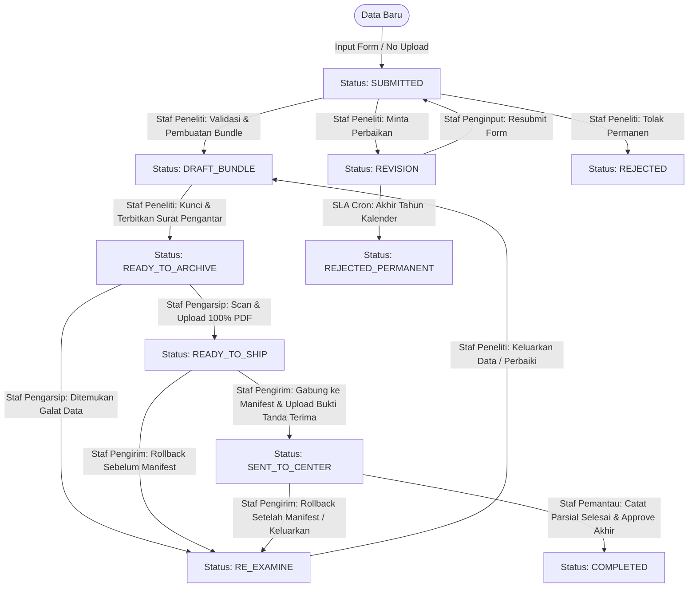

# SPESIFIKASI ALUR KERJA SISTEM (ARCHITAX_WORKFLOW.md)

Dokumen ini mendefinisikan secara mendalam dan terperinci seluruh proses bisnis, arsitektur data, hak akses (RBAC), mesin status (*state machine*), mekanisme penanganan eksepsi (*rollback*), batas waktu (SLA), serta spesifikasi visual **Clay Design System** pada aplikasi **Architax PBB**.

---

## 1. ARSITEKTUR DATA & ENUM

Sistem Architax dibangun di atas database MongoDB dengan Prisma ORM. Struktur relasi status dan peran pengguna diatur menggunakan skema enumerasi berikut:

### 1.1. Peran Pengguna (UserRole)
*   `STAF_PENGINPUT`: Staf atau pemohon yang bertugas mendaftarkan data awal permohonan.
*   `STAF_PENELITI`: Staf yang melakukan verifikasi data, memicu revisi/penolakan, menyusun Kertas Kerja, dan mengelompokkan data ke dalam Bundle.
*   `STAF_PENGARSIP`: Staf yang menerima berkas fisik, memindai (scan) dokumen, dan mengunggahnya ke sistem.
*   `STAF_PENGIRIM`: Staf yang menyusun Manifest Pengiriman kolektif dan mengirimkan berkas ke Kantor Pusat.
*   `STAF_PEMANTAU`: Staf di Kantor Pusat yang memantau penyelesaian fisik berkas dan melakukan pengarsipan statis final.
*   `SUPERVISOR`: Peran pengawas yang memantau performa, statistik, dan mendeteksi adanya kemacetan berkas (*bottleneck*).

### 1.2. Status Permohonan (ApplicationStatus) & Status Bundle (BundleStatus)
Status permohonan mengalir melalui tahapan linear dan bercabang sebagai berikut:

---

## 2. DETAIL ALUR KERJA TAHAP DEMI TAHAP

### TAHAP 1: INPUT STAGE (PENGINPUTAN DATA AWAL)
*   **Aktor Utama:** `STAF_PENGINPUT`.
*   **Kondisi Awal:** Form kosong / Pendaftaran permohonan baru.
*   **Prosedur Kerja:**
    1.  Penginput memilih **Jenis Pelayanan** (Objek Pajak Baru, Mutasi Sebagian, Mutasi Habis Update, Mutasi Habis Reguler, Pembetulan, Pengaktifan).
    2.  Mengisi Nomor Objek Pajak (NOP) yang secara otomatis divalidasi dan di-*masking* tepat 18 digit (`XX.XX.XXX.XXX.XXX-XXXX.X`).
    3.  Mengisi data Pemilik Lama (Subjek Pajak Eksisting) dan Objek Pajak Lama.
    4.  Mengisi data detail pemilik dan objek baru sesuai jenis pelayanan.
    *   *Catatan Penting:* Tidak ada proses unggah dokumen apa pun pada tahap ini.
*   **Kondisi Akhir:** Status permohonan tersimpan di database sebagai **`SUBMITTED`**.

### TAHAP 2: EXAMINATION STAGE (PENELITIAN & VALIDASI)
*   **Aktor Utama:** `STAF_PENELITI`.
*   **Kondisi Awal:** Antrean berkas berstatus **`SUBMITTED`** atau **`RE_EXAMINE`**.
*   **Prosedur Kerja:**
    1.  Peneliti membuka detail berkas permohonan.
    2.  Melakukan pencocokan data digital dengan dokumen fisik.
    3.  **Kertas Kerja Mutasi Sebagian (Khusus Jenis Pelayanan Mutasi Sebagian):**
        *   Peneliti wajib mengisi form Kertas Kerja untuk memecah 1 Objek Pajak Induk menjadi maksimal beberapa Objek Pecahan.
        *   Sistem melakukan kalkulasi otomatis secara *real-time*:
            $$\text{Luas Tanah Sisa} = \text{Luas Tanah Induk} - \sum(\text{Luas Tanah Pecahan})$$
            $$\text{Luas Bangunan Sisa} = \max\left(0, \text{Luas Bangunan Induk} - \sum(\text{Luas Bangunan Pecahan})\right)$$
        *   *Aturan Validasi:* Jika Luas Tanah Sisa $< 0$, sistem memunculkan galat merah dan menolak proses penyimpanan. Sisa luas bangunan yang minus secara otomatis dikunci di angka `0`.
*   **Kondisi Akhir:** Berkas siap dikelompokkan ke dalam Bundle.

### TAHAP 3: BUNDLING STAGE (PENGELOMPOKKAN & CETAK SURAT PENGANTAR)
*   **Aktor Utama:** `STAF_PENELITI`.
*   **Kondisi Awal:** Berkas permohonan yang telah divalidasi.
*   **Prosedur Kerja:**
    1.  Menggunakan fitur *Bulk Select* via *Floating Action Bar* pada antrean berkas.
    2.  **Aturan Interlocking & Homogenitas:**
        *   Satu bundle **hanya boleh berisi** berkas dengan Jenis Pelayanan yang sama.
        *   Kapasitas maksimal satu bundle dibatasi ketat **20 berkas permohonan**.
    3.  Memasukkan berkas terpilih ke dalam kelompok baru. Status internal berkas berubah menjadi **`DRAFT_BUNDLE`**. Data dalam status ini masih bisa dikeluarkan atau ditambahkan.
    4.  Menekan tombol `"Kunci Bundle"`. Sistem secara otomatis menerbitkan satu **Surat Pengantar** menggunakan penomoran konter global tahunan (*Global Sequence Counter*).
    5.  Status bundle dan seluruh berkas permohonan di dalamnya berubah menjadi **`READY_TO_ARCHIVE`**.
*   **Logika Surat Pengantar Mutasi Habis Update:**
    *   Sistem mengalokasikan `No Tanah` secara berurutan untuk setiap berkas di dalam bundle.
    *   Sistem mengalokasikan `No Bangunan` secara kondisional: Hanya diterbitkan jika $\text{Luas Bangunan Lama} \neq \text{Luas Bangunan Baru}$. Jika sama atau tidak memiliki bangunan, kolom dikosongkan dan konter tidak bertambah.

---

## 3. MEKANISME PENANGANAN EKSEPSI & SLA

### 3.1. Permohonan Bermasalah (Revisi & Tolak)
*   **Sebelum Berkas Masuk Bundle:**
    *   `STAF_PENELITI` dapat langsung menekan tombol `Minta Revisi` (status berubah menjadi **`REVISION`**) atau `Tolak` (status menjadi **`REJECTED`**).
*   **Setelah Berkas Masuk Bundle (`DRAFT_BUNDLE` / `READY_TO_ARCHIVE`):**
    *   Tombol aksi revisi/tolak terkunci secara sistem (*Interlocking Modals*).
    *   Staf wajib mengeluarkan berkas bermasalah tersebut dari bundle terlebih dahulu melalui aksi `"Keluarkan dari Bundle"`.
    *   Berkas sisa di dalam bundle tetap aman. Sistem secara dinamis memperbarui kuantitas total berkas dan mencetak ulang informasi di Surat Pengantar secara otomatis.
    *   Berkas yang telah dikeluarkan kini dapat diubah statusnya menjadi **`REVISION`** atau **`REJECTED`**.

### 3.2. Batas Waktu Otomatis (SLA Kalender)
*   Berkas berstatus **`REVISION`** diberikan tenggat perbaikan hingga akhir tahun kalender berjalan.
*   Sistem menjalankan *Cron Job* otomatis pada tanggal **31 Desember pukul 23:59:59**. Seluruh permohonan berstatus **`REVISION`** yang belum diajukan kembali (*resubmit*) akan dipaksa berubah menjadi **`REJECTED_PERMANENT`**.

---

## 4. TAHAP PENGARSIPAN & PENGIRIMAN (ROLLBACK WORKFLOW)

### TAHAP 4: ARCHIVING STAGE (DIGITALISASI DOKUMEN)
*   **Aktor Utama:** `STAF_PENGARSIP`.
*   **Kondisi Awal:** Fisik bundle diterima dengan status **`READY_TO_ARCHIVE`**.
*   **Prosedur Kerja:**
    1.  Pengarsip melakukan pemindaian (scanning) dokumen fisik satu per satu.
    2.  Mengunggah file PDF (ukuran 2MB - 5MB) ke Dropzone individual pada setiap baris berkas di tabel *Split-Screen View*.
    3.  Pembaruan status baris berubah dari merah (`❌ Belum Ada File`) menjadi hijau (`✅ Terupload`).
    4.  Tombol `"Approve Bundle"` hanya aktif ketika indikator progres unggah berkas mencapai **100%**.
*   **Aksi Sukses:** Status bundle bergeser menjadi **`READY_TO_SHIP`**.
*   **Alur Rollback (`RE_EXAMINE`):**
    *   Jika ditemukan kesalahan data pada berkas di dalam bundle, Staf Pengarsip mengklik `"Kembalikan ke Tahap Penelitian"`.
    *   Status bundle berganti menjadi **`RE_EXAMINE`**.
    *   `STAF_PENELITI` menerima kembali bundle tersebut, mengeluarkan berkas bermasalah, dan dapat menggantinya dengan berkas baru sejenis yang valid. File scan milik berkas valid yang tersisa tetap aman dan tidak terhapus.

### TAHAP 5: SHIPPING STAGE (PENGIRIMAN KE PUSAT)
*   **Aktor Utama:** `STAF_PENGIRIM`.
*   **Kondisi Awal:** Bundle berstatus **`READY_TO_SHIP`**.
*   **Prosedur Kerja:**
    1.  Pengirim menggabungkan beberapa bundle menjadi satu **Manifest Pengiriman** menggunakan papan Kanban digital (*Drag-and-Drop*).
    2.  Sistem menerbitkan nomor Manifest digital melalui konter tahunan global.
    3.  Setelah dokumen fisik diterima di Kantor Pusat dan lembar manifest fisik ditandatangani, Staf Pengirim mengunggah scan Manifest bertanda tangan (format JPG/PNG).
    4.  Tombol `"Approve Pengiriman"` ditekan. Status bundle dan berkas di dalamnya dikunci permanen menjadi **`SENT_TO_CENTER`**.
*   **Alur Rollback Manifest:**
    *   **Sebelum Manifest Disetujui:** Staf Pengirim dapat mengeklik `"Kembalikan ke Tahap Penelitian"`, mengembalikan status bundle menjadi **`RE_EXAMINE`**.
    *   **Setelah Masuk Manifest:** Staf wajib mengeklik `"Keluarkan Bundle dari Manifest"`. Sistem akan menghapus file scan manifest lama dari storage, memperbarui daftar manifest, dan memunculkan *alert banner* kuning untuk mencetak ulang manifest fisik serta mengunggah tanda terima yang baru.

---

## 5. TAHAP PEMANTAUAN & FINALIASASI ARSIP

### TAHAP 6: MONITORING & COMPLETION STAGE
*   **Aktor Utama:** `STAF_PEMANTAU`.
*   **Kondisi Awal:** Berkas berada di dalam bundle dengan status **`SENT_TO_CENTER`**.
*   **Prosedur Kerja:**
    1.  Pemantau melacak proses fisik pencetakan hasil dokumen PBB di pusat.
    2.  Jika dokumen permohonan individu selesai dicetak, Pemantau menggeser switch inline dari `PROSES` menjadi `SELESAI`. Ini dapat dilakukan secara bertahap (dicicil) per berkas.
    3.  Indikator progres (*Linear Progress Bar*) akan bertambah seiring banyaknya data yang selesai.
    4.  Tombol emas `"Arsip Permanen"` hanya akan aktif jika progres bundle telah mencapai **100% Selesai**.
*   **Kondisi Akhir:** Status berkas berubah menjadi **`COMPLETED`** (Selesai Sempurna) dan dikunci mati ke dalam database arsip statis.

---

## 6. INTEGRASI FONNTE API & AUDIT LOG

### 6.1. WhatsApp Notifications (Fonnte API Gateway)
Sistem backend memicu pesan otomatis WhatsApp ke nomor pemohon pada status-status kritis:
*   **Status REVISION:** Mengirimkan pesan WhatsApp berisi catatan detail perbaikan dari staf peneliti beserta peringatan tenggat waktu SLA tahun kalender berjalan.
*   **Status COMPLETED:** Mengirimkan pesan WhatsApp yang menginfokan bahwa dokumen PBB baru telah selesai diproses dan siap diambil di kantor layanan.

### 6.2. Log Audit Keamanan (AuditLog)
Tabel `AuditLog` di MongoDB bertindak sebagai penyimpan jejak digital mutlak yang bersifat *Immutable* (tidak dapat diubah atau dihapus, API update/delete dikunci total).
Log merekam:
1.  *Timestamp* (Waktu kejadian).
2.  Data Akun Aktor (ID, nama, dan peran).
3.  Jenis Entitas & ID Entitas yang diubah (`Permohonan`, `Bundle`, `Manifest`).
4.  Aksi Spesifik yang dilakukan (misalnya: `"Mengeluarkan berkas [NOP] dari bundle [ID]"`).
5.  Nilai sebelum dan sesudah perubahan data (`oldValue` & `newValue`).

---

## 7. SPESIFIKASI VISUAL LAYOUT (CLAY DESIGN SYSTEM)

Untuk memastikan pengalaman pengguna yang profesional, visual antarmuka harus mematuhi token desain Clay berikut:

### 7.1. Bar Kontrol Filter & Segmentasi Tab
*   **Tabs Section (Segmented Pills):** Wadah abu-abu `#F3F4F6` dengan border `#E5E7EB`, radius `6px`, tinggi `28px`, dengan pill aktif berwarna putih bersih `#ffffff` yang memiliki bayangan halus `boxShadow: '0 1px 2px 0 rgba(0, 0, 0, 0.05)'`.
*   **Filter Layanan (Service Type):** Berbentuk **Owner filter chip** tersegmen bertinggi `24px` dengan border luar tipis `#E5E7EB`, label di kiri, dan dropdown trigger di kanan yang memiliki hover background `rgba(17, 24, 39, 0.05)` dengan transisi transparan halus.
*   **Filter Status:** Berbentuk **Filters toggle button** mandiri bertinggi `24px` tanpa border luar, memiliki ikon filter disamping teks `"Status: [Pilihan]"`, dan warna hover background `rgba(17, 24, 39, 0.05)`.
    *   *Interlocking Selector:* Pada komponen `SelectTrigger` di berkas `permohonan-filters.tsx`, kelas `className="[&>svg:last-child]:hidden"` digunakan untuk mematikan ikon chevron bawaan dari shadcn/ui agar tidak terjadi tampilan panah ke bawah ganda.
*   **Tombol Reset:** Berwarna abu-abu `#6B7280` bertinggi `24px` dengan hover background `rgba(17, 24, 39, 0.05)`.

### 7.2. Spreadhseet style Fixed Table
*   **Layout:** Menggunakan margin negatif `-mx-8` (atau sejenisnya) agar melebar hingga ke ujung grid konten, dengan pembatas border atas/bawah tipis `#E5E7EB`.
*   **Header Tabel (`thead`):** Latar belakang putih murni `#ffffff`, border bawah `#E5E7EB`, ukuran teks sangat kecil `text-[11px]`, ketebalan `semibold`, warna teks abu-abu `#6B7280`, dan semua teks dalam format huruf kapital (`uppercase`).
*   **Baris data (`tbody tr`):** Tinggi baris konsisten `h-11` atau `h-12` dengan transisi hover latar belakang abu-abu ultra-ringan `#F9FAFB`.
*   **Tautan Berkas:** Nomor berkas wajib menggunakan tautan berwarna biru Clay `#2563EB` yang bersih (tanpa garis bawah kecuali saat di-hover).
