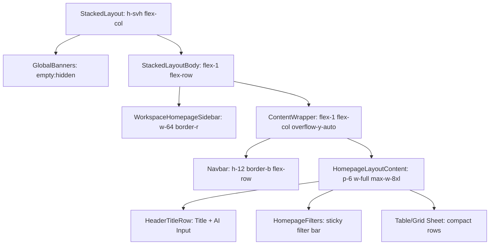

# CLAY DESIGN SYSTEM
## Visual Reverse Engineering & UI Architecture Analysis

Dokumen ini berisi dokumentasi lengkap hasil *reverse engineering* visual design system, interaction design, dan UI architecture dari file referensi Clay. Dokumentasi ini disusun secara terstruktur untuk dijadikan acuan implementasi visual pada aplikasi.

---

# 1. BRAND & VISUAL IDENTITY

*   **Visual Personality**: 
    Clay menampilkan kepribadian visual yang memadukan keandalan teknis (*enterprise-grade*) dengan estetika modern yang sangat bersih dan rapi (*minimalist-premium*). Penggunaan grid presisi tinggi, garis pembatas yang sangat tipis, dan *contrast hierarchy* yang cerdas menciptakan kesan alat produktivitas tingkat lanjut yang canggih namun mudah diakses.
*   **Design Philosophy**:
    *Precision-meets-utility*. Setiap elemen visual dirancang memiliki tujuan fungsionalitas yang tinggi dengan gangguan minimal. Penggunaan ruang putih (*white space*) di sekitar area kerja padat data memberikan ruang bernapas bagi mata pengguna, sementara warna aksen yang hidup menyoroti elemen interaktif terpenting secara taktis.
*   **Visual Principles**:
    *   **Data Density without Clutter**: Menampilkan data sebanyak mungkin dalam ruang terbatas menggunakan ukuran font kecil (12px–14px) dan *row height* kompak (34px) tanpa membuat antarmuka terasa sesak.
    *   **Subtle Boundaries**: Menggunakan garis tepi 1px yang sangat tipis dengan tingkat kontras rendah (`var(--color-border-secondary)`) sebagai penanda batas grid.
    *   **Purposeful Accents**: Pewarnaan penuh energi (seperti biru cerah, ungu, orange-light) hanya digunakan pada kondisi aktif, status badge, atau elemen interaksi penting.
    *   **Flat Aesthetics with Depth**: Menghindari gradien tebal atau bayangan dramatis. Kedalaman UI dicapai melalui permainan warna permukaan (*background wash* dan *sunken surface*) serta bayangan tipis pada *overlay* menu.
*   **Perceived Brand Positioning**:
    Premium modern SaaS, *tool* produktivitas berkinerja tinggi, berorientasi pada data (*data-centric*), elegan, dan ramah terhadap developer (*developer-friendly*).
*   **Overall Aesthetic Direction**:
    Antarmuka berbasis grid tabular, minimalis, mengutamakan keterbacaan data, dengan penataan layout bertingkat (*stacked/split view*) yang seimbang dan efisien.

---

# 2. COLOR SYSTEM

Clay menggunakan sistem warna teratur yang dibagi berdasarkan kategori fungsional dengan palet warna yang sangat terkalibrasi:

## Core Palettes (Hex, RGB, HSL)

| Token Nama | Nilai HEX | Nilai RGB | Nilai HSL | Fungsionalitas Visual |
| :--- | :--- | :--- | :--- | :--- |
| `--color-black` | `#000000` | `rgb(0, 0, 0)` | `hsl(0, 0%, 0%)` | Teks utama, ikon kontras tinggi |
| `--color-white` | `#ffffff` | `rgb(255, 255, 255)` | `hsl(0, 0%, 100%)` | Background utama (`bg-primary`), surface kartu |
| `--color-nightshade-950` | `#16181f` | `rgb(22, 24, 31)` | `hsl(227, 17%, 10%)` | Background sidebar gelap/teks gelap |
| `--color-nightshade-800` | `#3c414d` | `rgb(60, 65, 77)` | `hsl(222, 12%, 27%)` | Teks sekunder, label menu inaktif |
| `--color-nightshade-700` | `#525a69` | `rgb(82, 90, 105)` | `hsl(219, 12%, 37%)` | Teks tersier, keterangan/keterangan menu |
| `--color-nightshade-500` | `#979da9` | `rgb(151, 157, 169)` | `hsl(220, 10%, 63%)` | Teks placeholder, ikon inaktif |
| `--color-nightshade-300` | `#d6d9df` | `rgb(214, 217, 223)` | `hsl(220, 10%, 86%)` | Border primer, garis pembatas utama |
| `--color-nightshade-200` | `#e6e8ec` | `rgb(230, 232, 236)` | `hsl(220, 10%, 91%)` | Border sekunder, pembatas dalam komponen |
| `--color-nightshade-100` | `#eff1f3` | `rgb(239, 241, 243)` | `hsl(210, 11%, 95%)` | Border tersier, background wash |
| `--color-nightshade-50` | `#f7f8f9` | `rgb(247, 248, 249)` | `hsl(210, 8%, 97%)` | Background sekunder (`bg-secondary` / sunken panel) |

## Warm Oat Palette (Warm Beige Canvas)

| Token Nama | Nilai HEX | Nilai RGB | Nilai HSL | Fungsionalitas Visual |
| :--- | :--- | :--- | :--- | :--- |
| `--color-oat-950` | `#1b1a18` | `rgb(27, 26, 24)` | `hsl(40, 6%, 10%)` | Teks gelap hangat |
| `--color-oat-500` | `#c0bbaf` | `rgb(192, 187, 175)` | `hsl(42, 12%, 72%)` | Border hangat |
| `--color-oat-200` | `#f3f2ed` | `rgb(243, 242, 237)` | `hsl(50, 18%, 94%)` | Panel samping hangat |
| `--color-oat-100` | `#f9f8f6` | `rgb(249, 248, 246)` | `hsl(40, 10%, 97%)` | Background wash hangat |
| `--color-oat-50` | `#fffcfa` | `rgb(255, 252, 250)` | `hsl(16, 100%, 99%)` | Canvas utama hangat |

## Accent & Interactive Palettes (HEX, RGB, HSL)

| Token Nama | Nilai HEX | Nilai RGB | Nilai HSL | Fungsionalitas Visual |
| :--- | :--- | :--- | :--- | :--- |
| `--color-blueberry-600` | `#0667d9` | `rgb(6, 103, 217)` | `hsl(211, 95%, 44%)` | Warna teks interaktif aktif, link hover |
| `--color-blueberry-500` | `#0382f7` | `rgb(3, 130, 247)` | `hsl(209, 98%, 49%)` | Background tombol utama, focus outline |
| `--color-blueberry-100` | `#d7ebfe` | `rgb(215, 235, 254)` | `hsl(209, 95%, 92%)` | Background baris tabel terpilih, menu aktif |
| `--color-blueberry-50` | `#ecf6ff` | `rgb(236, 246, 255)` | `hsl(209, 100%, 96%)` | Background wash tombol interaktif |
| `--color-ube-600` | `#7934f0` | `rgb(121, 52, 240)` | `hsl(262, 86%, 57%)` | Warna teks aksen ungu |
| `--color-ube-500` | `#8b5cf6` | `rgb(139, 92, 246)` | `hsl(258, 91%, 66%)` | Warna latar aksen ungu |
| `--color-ube-50` | `#f5f3ff` | `rgb(245, 243, 255)` | `hsl(250, 100%, 98%)` | Latar wash ungu |
| `--color-dragonfruit-600` | `#ff52c2` | `rgb(255, 82, 194)` | `hsl(321, 100%, 66%)` | Warna teks aksen merah muda (pink) |
| `--color-dragonfruit-500` | `#ff7ad5` | `rgb(255, 122, 213)` | `hsl(319, 100%, 74%)` | Warna latar aksen merah muda |
| `--color-slushie-600` | `#2abeea` | `rgb(42, 190, 234)` | `hsl(194, 82%, 54%)` | Warna teks aksen cyan/teal |
| `--color-slushie-500` | `#3bd3fd` | `rgb(59, 211, 253)` | `hsl(193, 98%, 61%)` | Warna latar aksen cyan/teal |

## Status & Feedback Palettes (HEX, RGB, HSL)

| Token Nama | Nilai HEX | Nilai RGB | Nilai HSL | Fungsionalitas Visual |
| :--- | :--- | :--- | :--- | :--- |
| `--color-matcha-700` | `#02693e` | `rgb(2, 105, 62)` | `hsl(155, 96%, 21%)` | Sukses / Konfirmasi teks |
| `--color-matcha-600` | `#078a52` | `rgb(7, 138, 82)` | `hsl(154, 90%, 28%)` | Sukses utama / Teks hijau |
| `--color-matcha-500` | `#0dac65` | `rgb(13, 172, 101)` | `hsl(153, 86%, 36%)` | Sukses latar indicator |
| `--color-matcha-50` | `#eefff1` | `rgb(238, 255, 241)` | `hsl(131, 100%, 97%)` | Latar wash sukses (hijau muda) |
| `--color-tangerine-700` | `#c34e1b` | `rgb(195, 78, 27)` | `hsl(18, 76%, 44%)` | Warning teks (orange gelap) |
| `--color-tangerine-500` | `#f58c50` | `rgb(245, 140, 80)` | `hsl(22, 91%, 64%)` | Latar status warning |
| `--color-tangerine-50` | `#fff3ed` | `rgb(255, 243, 237)` | `hsl(19, 100%, 97%)` | Latar wash warning (orange muda) |
| `--color-lemon-800` | `#b37601` | `rgb(179, 118, 1)` | `hsl(39, 99%, 35%)` | Teks info/badge khusus (kuning-tua) |
| `--color-lemon-500` | `#f6c23d` | `rgb(246, 194, 61)` | `hsl(43, 91%, 60%)` | Latar status info/upgrade |
| `--color-lemon-50` | `#fefae8` | `rgb(254, 250, 232)` | `hsl(49, 92%, 95%)` | Latar wash kuning |
| `--color-pomegranate-700` | `#b21a3f` | `rgb(178, 26, 63)` | `hsl(345, 75%, 40%)` | Bahaya / Error teks |
| `--color-pomegranate-600` | `#dd2c53` | `rgb(221, 44, 83)` | `hsl(347, 73%, 52%)` | Bahaya utama |
| `--color-pomegranate-500` | `#e94d68` | `rgb(233, 77, 104)` | `hsl(350, 78%, 61%)` | Latar indikator bahaya/error |
| `--color-pomegranate-50` | `#fff1f2` | `rgb(255, 241, 242)` | `hsl(356, 100%, 97%)` | Latar wash bahaya/error (merah muda) |

---

# 3. TYPOGRAPHY SYSTEM

Sistem tipografi Clay sangat mengandalkan variasi berat (*weight*) dan *letter spacing* negatif pada ukuran judul untuk menciptakan karakter visual yang khas:

*   **Font Family**:
    *   *Primary Font*: `"Inter var"`, dengan fallback `ui-sans-serif, system-ui, -apple-system, BlinkMacSystemFont, "Segoe UI", Roboto, "Helvetica Neue", Arial, sans-serif`.
    *   *Secondary/Display Font*: `"Roobert"` (digunakan untuk memberikan kesan premium, modern, dan sedikit membulat pada judul-judul utama).
    *   *Mono Font*: `ui-monospace, "Cascadia Code", "Source Code Pro", Menlo, Consolas, "DejaVu Sans Mono", monospace`.
*   **Font Scale & Hierarchy**:
    *   **H1 (Page Title)**: `22px` (atau `1.375rem`) | Line Height: `28px` (1.27) | Letter Spacing: `-0.55px` (pada teks *"Hey [Name], ready to get started?"*).
    *   **H2 (Section Header)**: `1.5rem` (24px) | Line Height: `32px` (1.33) | Letter Spacing: `-0.5px`.
    *   **H3 (Card Title / Subsection)**: `1.25rem` (20px) | Line Height: `28px` (1.4).
    *   **H4 (List/Folder Header)**: `1.125rem` (18px) | Line Height: `28px` (1.55) | Weight: `font-bold` (700).
    *   **H5 (Widget Title / Card Sub)**: `16px` (`text-base`) | Line Height: `24px` (1.5) | Weight: `font-semibold` (600).
    *   **H6 (Small Label / Column Header)**: `14px` (`text-sm`) | Line Height: `20px` (1.42) | Weight: `font-semibold` (600).
    *   **Body (Running Text / Input Text)**: `14px` (`text-sm`) | Line Height: `20px` (1.428) | Weight: `font-normal` (400) atau `font-medium` (500).
    *   **Caption (Metadata / Badge / Fine-print)**: `12px` (`text-xs`) | Line Height: `16px` (1.33) | Weight: `font-normal` (400) atau `font-medium` (500).
    *   **Label (Form Label)**: `12px` atau `14px` | Weight: `font-semibold` atau `font-medium`.
*   **Spacing Rules**:
    *   *Letter Spacing*: Clay menerapkan pelacakan huruf yang ketat pada judul: `tracking-tight` (`-0.025em`) untuk H1/H2, dan `tracking-[-0.55px]` untuk judul personalisasi utama.
    *   *Paragraph Spacing*: Rata-rata paragraf dipisahkan dengan margin bawah `mb-4` (16px).

---

# 4. SPACING SYSTEM

Clay menggunakan sistem grid berbasis 4px (0.25rem) dengan kelipatan teratur untuk mempertahankan ritme vertikal dan horizontal yang konsisten:

*   **Spacing Scale Table**:

| Token Skala | Nilai REM | Nilai Piksel (1rem = 16px) | Penggunaan Visual Utama |
| :--- | :--- | :--- | :--- |
| `--space--2` | `0.125rem` | 2px | Jarak sangat rapat, border offset |
| `--space--4` | `0.25rem` | 4px | Padding badge, jarak ikon ke teks |
| `--space--6` | `0.375rem` | 6px | Gap baris menu dropdown |
| `--space--8` | `0.5rem` | 8px | Padding sel tabel, gap filter chips |
| `--space--10` | `0.625rem` | 10px | Padding tombol mini |
| `--space--12` | `0.75rem` | 12px | Padding menu sidebar item, gap horizontal |
| `--space--16` | `1rem` | 16px | Padding input field, margin antar elemen standar |
| `--space--20` | `1.25rem` | 20px | Padding modal/popover, margin konten |
| `--space--24` | `1.5rem` | 24px | Padding kartu dashboard, gap layout utama |
| `--space--32` | `2rem` | 32px | Jarak antar grup konten besar |
| `--space--48` | `3rem` | 48px | Tinggi Header/Navbar utama |
| `--space--64` | `4rem` | 64px | Padding section besar |
| `--space--96` | `6rem` | 96px | Margin pembatas halaman luar |

*   **Spacing Rhythm**:
    Antarmuka ini didominasi oleh ritme padat di dalam lembar kerja (*data workspace*) dengan padding `8px` (py-2) dan `34px` (tinggi baris), namun menggunakan ritme lega `16px` (gap-4) dan `24px` (gap-6) pada pembungkus luar (*outer shell*) untuk memberikan kontras struktural.

---

# 5. GRID SYSTEM

Sistem grid pada lembar kerja dan layout dashboard Clay dikunci dengan aturan perataan yang ketat:

*   **Container Width**:
    *   *Max Width*: Konten utama dibatasi pada lebar `--container-7xl: 80rem` (1280px) atau `--max-width-8xl: 88rem` (1408px) untuk menjaga keterbacaan data pada layar ultra-lebar.
    *   *Content Width*: Fleksibel (`w-full` dengan padding horizontal lateral `px-4` atau `px-6`).
*   **Grid Columns & Structure**:
    *   Dashboard utama menggunakan struktur baris grid modular yang memanfaatkan subgrid (`grid-cols-subgrid`) untuk memastikan kolom header tabel dan kolom baris data sejajar secara matematis tanpa pergeseran piksel.
    *   Kolom checkbox default memiliki lebar tetap `w-8` atau `w-10`.
    *   Kolom data teks dominan menggunakan properti `flex-grow` atau lebar persentase minimal 150px untuk mencegah teks terpotong terlalu ekstrim.
*   **Gutter Size**:
    Default menggunakan `var(--gutter)` yang terikat pada `--spacing(2)` (8px) hingga `--spacing(4)` (16px).
*   **Alignment Rules**:
    Semua sel data dan teks di-align kiri (`text-left`, `items-center`) kecuali kolom berisi nilai angka atau menu aksi yang di-align kanan (`text-right`).

---

# 6. RESPONSIVE SYSTEM

Clay dirancang responsif dengan mekanisme penyusutan komponen (*collapsing strategy*) yang dinamis:

*   **Responsive Breakpoints**:
    *   **Mobile (sm)**: `640px` (40rem)
    *   **Tablet (md)**: `768px` (48rem)
    *   **Desktop (lg)**: `1024px` (64rem)
    *   **Widescreen (xl)**: `1280px` (80rem)
    *   **Ultra-wide (2xl)**: `1536px` (96rem)

*   **Breakpoint Layout Adaptations**:
    *   **Sidebar Collapsing**: Pada desktop (> 1024px), sidebar tampil penuh (`--sidebar-width: 16rem`). Di bawah 1024px, sidebar menyusut ke mode ikon saja (`--sidebar-width-icon: 3rem`) dengan interaksi hover melayang (*expand-on-hover*). Pada perangkat mobile (< 768px), sidebar disembunyikan penuh (`w-0`) dan hanya muncul sebagai laci geser (*drawer*) melalui tombol picu (*sidebar trigger*) di navbar atas.
    *   **Table Scroll Behavior**: Grid tabular data lembar kerja memiliki lebar minimum statis `950px` yang dibungkus dalam wadah `overflow-x-auto`. Pada perangkat tablet dan mobile, area tabel tidak menyusut melainkan mempertahankan kepadatannya dan dapat digeser secara horizontal untuk mencegah data bertumpuk.
    *   **Form & Filters Stacking**: Panel filter dashboard (`HomepageFilters`) tampil sejajar secara horizontal pada desktop, namun melipat menjadi baris bertumpuk (*stacked rows*) atau disederhanakan menjadi satu tombol modal filter pada layar di bawah 640px.

---

# 7. RADIUS SYSTEM

Radius sudut (border-radius) Clay memberikan kesan modern dan ramah tanpa terkesan terlalu kekanak-kanakan (tidak menggunakan bentuk oval/pill penuh pada tombol utama):

*   **Radius Scale**:
    *   `--radius-xs` (2px): Digunakan untuk batas checkbox, indikator sangat kecil.
    *   `--radius-sm` (4px) / `--radii--input`: Batas input field standar, tombol ikon kecil, filter chips.
    *   `--radius-md` (6px) / `--radii--popover`: Tombol aksi utama, menu dropdown, popup kecil.
    *   `--radius-lg` (8px) / `--radii--modal`: Kartu dashboard utama, panel popup modal, dialog peringatan.
    *   `--radius-xl` (12px): Kartu fitur promo, wadah notifikasi popup melayang.
    *   `--radius-2xl` (16px): Badge melingkar besar, avatar pengguna berbentuk squircle (`--avatar-radius: 20%`).
    *   `--radii--pill` (9999px): Badge pill "Upgrade" atau "Beta".

---

# 8. SHADOW SYSTEM

Pencahayaan dan kedalaman UI Clay sangat halus, menolak penggunaan bayangan hitam pekat:

*   **Shadow Value Output**:
    *   **Elevation 1 (xs - Faint Shadow)**: 
        `0 1px 2px 0 rgba(0, 0, 0, 0.05)`
        *Penggunaan*: Tombol sekunder putih di atas canvas putih.
    *   **Elevation 2 (sm - Card Shadow)**: 
        `0 1px 3px 0 rgba(0, 0, 0, 0.1), 0 1px 2px -1px rgba(0, 0, 0, 0.1)`
        *Penggunaan*: Kartu dashboard inaktif, tombol mengambang kecil.
    *   **Elevation 3 (md - Dropdown & Popover)**: 
        `0px 2px 4px -2px rgba(0, 0, 0, 0.04), 0px 4px 6px -1px rgba(0, 0, 0, 0.08)`
        *Penggunaan*: Menu dropdown aktif, tooltip besar.
    *   **Elevation 4 (lg - Popover Floating)**: 
        `0 0 1px rgba(0, 0, 0, 0.5), 0 8px 16px rgba(0, 0, 0, 0.15)`
        *Penggunaan*: Popover notifikasi (`rnf-notification-feed-popover`), panel asisten melayang.
    *   **Modal Elevation (xl - Overlay)**: 
        `0 0 1px rgba(0, 0, 0, 0.5), 0 20px 40px rgba(0, 0, 0, 0.3)`
        *Penggunaan*: Modal dialog tengah layar, memisahkan modal secara tegas dari latar belakang gelap redup (*scrim*).

---

# 9. MOTION SYSTEM

Interaksi transisi pada Clay dirancang cepat dan halus untuk mempertahankan performa visual yang responsif:

*   **Animation Styles & Timings**:
    *   *Default Duration*: `--default-transition-duration: .15s` (150ms) untuk perubahan warna teks/latar hover.
    *   *Layout Duration*: `200ms` (`duration-200`) dengan fungsi easing `linear` atau `cubic-bezier(.4, 0, .2, 1)` untuk transisi penyusutan lebar sidebar.
*   **Micro-Animations**:
    *   *Attention Blink*: Animasi berdenyut pada lampu status aktif (`--animate-status-blink`) menggunakan durasi 0.5 detik bernada bolak-balik (*alternate*).
    *   *Loading State Shimmer*: Animasi gradien menyapu (`--animate-shimmer`) dengan durasi 2 detik berjalan terus-menerus untuk memvisualisasikan data yang sedang dimuat (*skeleton load*).
    *   *Hover Scale*: Kartu interaktif atau tombol ikon tertentu mengalami pergeseran posisi vertikal negatif (naik 1px) saat diarahkan oleh kursor.

---

# 10. ICONOGRAPHY

*   **Icon Library**: Clay menggunakan SVG *stroke outline* yang konsisten (setara dengan Lucide Icons).
*   **Icon Size Scale**:
    *   `size-3` (12px) / `size-3.5` (14px): Digunakan di dalam badge kecil, tombol mini (Upgrade), dan status checkbox.
    *   `size-4` (16px): Ukuran ikon standar untuk sidebar menu items, tombol header, dan ikon pencarian.
    *   `size-5` (20px) / `size-6` (24px): Digunakan untuk ikon branding, tombol picu navigasi utama, atau ilustrasi mini.
*   **Icon Weight**: Garis luar ikon konsisten pada ketebalan `1.5px` hingga `2px` untuk menjamin keterbacaan pada ukuran terkecil.
*   **Icon Placement Rules**:
    Ikon selalu ditempatkan di sisi kiri label teks dengan gap `gap-2` (8px). Untuk menu dropdown interaktif, ikon panah (chevron) diposisikan di paling kanan dengan margin otomatis (`ml-auto`).

---

# 11. LAYOUT ARCHITECTURE

Struktur tata letak aplikasi Clay dibangun di atas sistem kerangka (*app shell*) yang sangat kokoh:



1.  **Application Shell**: Pembungkus paling luar (`StackedLayout`) menggunakan properti `flex h-svh w-full flex-col bg-bg-primary`.
2.  **Sidebar**: Tersemat di sisi kiri (`border-r border-border-secondary`) sebagai navigasi tingkat atas.
3.  **Content Wrapper**: Mengambil sisa ruang horizontal (`flex-1 flex flex-col min-w-0 overflow-y-auto`).
4.  **Navbar/Topbar**: Berada di atas area konten dengan tinggi tetap 48px, memegang kendali global seperti notifikasi dan status workspace.
5.  **Page Container**: Menggunakan margin terpusat dengan padding `p-6` atau `px-8 py-6` tergantung lebar layar.

---

# 12. SIDEBAR DESIGN

Sidebar Clay dirancang sebagai jangkar navigasi utama dengan estetika semi-sunken:

*   **Width & Structural Metrics**:
    *   *Expanded Width*: `--sidebar-width: 16rem` (256px).
    *   *Collapsed Width*: `--sidebar-width-icon: 3rem` (48px).
    *   *Header Height*: `48px` (h-12) dengan pembatas bawah `border-b border-border-secondary`.
*   **Navigation Hierarchy**:
    *   *Logo Area*: Bagian atas memuat `WorkspaceSidebarLogo` berbentuk gambar logo Clay yang menyusut menjadi ikon saja pada mode *collapsed*.
    *   *Main Navigation Items*: Navigasi daftar menu (`Home`, `Campaigns`, `Claygents`, `Functions`) dibuat menggunakan tag list `ul/li`.
    *   *Active State*: Baris menu yang aktif ditandai dengan kelas `data-active:bg-(--sidebar-menu-active-bg)` (warna Blueberry-100 `#d7ebfe`) dan warna teks biru `data-active:text-(--sidebar-menu-active-text)` (`#0667d9`).
    *   *Hover State*: Menu non-aktif yang disorot berubah warna latar belakangnya menjadi abu-abu sangat transparan `hover:bg-(--sidebar-menu-hover-bg)` (`var(--color-bg-emphasis)` / `#16181f0d`).
    *   *Spacing*: Ikon menu dan label dipisahkan oleh gap `gap-2` (8px). Tinggi baris menu dirancang tetap `h-8` (32px).

---

# 13. HEADER DESIGN

Navigasi atas (*navbar/topbar*) dirancang sangat bersih dengan fokus pada fungsionalitas bantuan:

*   **Height & Layout**:
    *   Tinggi tetap `48px` (`--height-nav: 48px`).
    *   Penataan menggunakan kontainer Flex: `flex items-center w-full px-4 border-b border-border-secondary bg-bg-primary`.
*   **Elements Alignment**:
    *   *Left Side*: Memuat judul halaman saat ini atau breadcrumbs untuk penunjuk lokasi kerja (*navigation crumbs*).
    *   *Center Space*: Dibiarkan kosong (`flex-1`) atau menampung kolom pencarian global dalam skenario pencarian terfokus.
    *   *Right Side*: Menampung komponen widget pengguna:
        *   `WorkspaceTopbarPlanWidget`: Tombol indikator sisa kredit akun (`h-7`, ukuran teks `text-xs/5`).
        *   `Upgrade Button`: Tombol badge oranye untuk peningkatan layanan.
        *   `Notification Trigger`: Tombol lonceng interaktif dengan indikator titik merah/biru `size-1.5` sebagai penanda pesan belum dibaca.
        *   `User Avatar`: Lingkaran foto profil atau inisial nama berbentuk squircle (28px) dengan border tipis.

---

# 14. CARD SYSTEM

Kartu (*cards*) digunakan untuk memilah informasi modular atau menampung aksi cepat:

*   **Padding & Spacing**:
    *   Padding internal kartu default adalah `p-4` (16px) atau `p-6` (24px) untuk kartu besar.
    *   Batas sudut kartu menggunakan radius `rounded-lg` (8px).
*   **Visual Hierarchy**:
    *   *Title Structure*: Header kartu menampung judul kecil menggunakan ukuran `text-base` (16px) dengan ketebalan `font-semibold` (600), sering kali dipasangkan dengan ikon mini di kirinya.
    *   *Content Structure*: Area tengah diisi teks deskripsi pendek `text-sm text-content-secondary` dengan margin atas `mt-1` atau `mt-2`.
    *   *Footer Structure*: Bagian bawah kartu berisi baris aksi opsional (seperti link "Create" atau "Import") dengan format teks link biru `text-content-action`.

---

# 15. TABLE SYSTEM

Sistem tabel merupakan komponen dengan densitas data tertinggi di dalam sistem Clay, didesain menyerupai aplikasi spreadsheet profesional:

*   **Row Metrics**:
    *   *Row Height*: Diatur ketat pada nilai `--ROW-HEIGHT: 34px`.
    *   *Header Height*: Rata-rata 34px untuk menyelaraskan proporsi grid.
*   **Header Style**:
    *   Tag `th` memiliki gaya visual: `truncate p-2 text-xs font-semibold whitespace-pre-wrap text-content-secondary border-b border-t border-solid border-(--table-border-header-color)`.
    *   Teks menggunakan ukuran `text-xs` (12px) dengan berat `font-semibold` (600) untuk membedakannya dengan teks baris data.
*   **Row States**:
    *   *Hover State*: Baris yang disorot berubah warna latar belakangnya menjadi abu-abu sangat tipis `bg-bg-primary-hover` (`#f7f8f9`).
    *   *Selection State*: Baris yang dicentang/terpilih berubah latar belakangnya secara konstan menjadi biru muda `bg-(--table-selected-bg)` (`#d7ebfe`).
*   **Table Components**:
    *   *Row Drag Indicator*: Kolom pertama sering kali menampung ikon titik penarik (*drag handle*) untuk menyusun ulang baris.
    *   *Checkbox Column*: Kolom khusus checkbox seleksi massal dengan ukuran checkbox kompak `size-4.5`.

---

# 16. FORM SYSTEM

Sistem formulir Clay dioptimalkan untuk meminimalkan kesalahan input data pengguna:

*   **Label Style**:
    Label formulir ditulis dengan gaya tulisan `text-xs` atau `text-sm font-semibold` menggunakan warna teks primer `text-content-primary`, dipisahkan dengan gap `gap-1` (4px) dari input di bawahnya.
*   **Input Field Structure**:
    *   Input dibungkus di dalam kelas kontrol `FormControlBaseUI`.
    *   Input dasar: `text-sm flex bg-transparent focus:outline-hidden data-disabled:opacity-50 w-full`.
    *   Kontainer input didesain dengan tinggi 32px atau 36px, dibatasi oleh border tipis `border-border-primary` (#d6d9df) yang berubah tebal saat fokus.
*   **Validation States**:
    *   *Focused State*: Garis tepi berubah warna menjadi biru aksen `border-(--color-border-action)` dan memicu cincin fokus luar `focus-visible:ring-2 focus-visible:ring-outline-focus-ring`.
    *   *Error State*: Border berubah menjadi merah `border-color-pomegranate-600` dengan pesan kesalahan kecil di bawah input berwarna serupa.

---

# 17. BUTTON SYSTEM

Sistem tombol Clay dibagi menjadi beberapa tingkatan kepentingan (hirarki aksi):

## Button Variants & Styling

| Tipe Tombol | Warna Latar (Background) | Warna Teks | Border | Hover State |
| :--- | :--- | :--- | :--- | :--- |
| **Primary** | `var(--color-blueberry-500)` | `#ffffff` | Tanpa border | Latar berubah ke Blueberry-600 (`#0667d9`) |
| **Secondary** | `#ffffff` | `var(--color-nightshade-950)` | `1px solid var(--color-border-primary)` | Latar berubah ke abu-abu tipis (`#f7f8f9`) |
| **Destructive** | `var(--color-pomegranate-600)` | `#ffffff` | Tanpa border | Latar berubah ke merah gelap |
| **Ghost** | Transparan | `var(--color-nightshade-800)` | Tanpa border | Latar berubah ke `bg-content-primary/5` |

## Standard Metrics
*   **Height**: Standard dashboard action button is `h-7` (28px) or `h-8` (32px).
*   **Padding**: `px-3` (12px) horizontal, `py-0` or `py-1` vertical.
*   **Border Radius**: `rounded` (setara 4px atau 6px).
*   **Icon Gap**: Jika tombol memiliki ikon pendukung, gap diatur sebesar `gap-x-1.5` (6px) dengan ukuran ikon terbatas pada `size-3` (12px) atau `size-4` (16px).

---

# 18. FEEDBACK COMPONENTS

Clay memberikan umpan balik visual yang cepat melalui elemen status terkalibrasi:

*   **Badges**:
    *   *Upgrade Badge*: Tombol pill penunjuk limitasi akun. Menggunakan latar belakang `bg-(--badge-bg-color)` (orange-muda `#ffe9d5`) dengan border oranye `#fdd4b7` dan teks orange `#c34e1b`. Ukuran font `text-xs`, tinggi `h-5` (20px), sangat ringkas.
    *   *Beta Badge*: Penanda fitur uji coba. Berwarna latar kuning muda, teks kuning-gelap `#b37601` dengan sudut membulat penuh `rounded-2xl`.
*   **Notifications Cell**:
    *   Daftar notifikasi individual (`rnf-notification-cell`) menggunakan padding `py-3 px-4` dengan pemisah baris bawah `#e4e8ee`.
    *   Pesan baru yang belum dibaca memiliki dot indikator biru bulat kecil di sebelah kanannya.
*   **Skeleton Loading State**:
    *   Area tabel yang sedang memuat data digantikan oleh kotak abu-abu tumpul (`rounded-md`, latar `#eff1f3`) yang berkedip atau berdenyut menggunakan efek shimmer.

---

# 19. OVERLAY COMPONENTS

Komponen overlay (melayang) diletakkan di atas kanvas dengan bayangan kontras:

*   **Modal & Dialog**:
    *   Menggunakan penutup latar belakang buram redup (`bg-scrim` / `#16181f80`) untuk memblokir interaksi di luar modal.
    *   Kontainer modal memiliki radius `rounded-lg` (8px) dan dilengkapi bayangan pekat `--shadows--modal`.
*   **Dropdown Menu**:
    *   Menggunakan penataan posisi Popper untuk presisi koordinat kemunculan menu.
    *   Gaya visual: kontainer putih bersih (`bg-white`), border tipis di sekelilingnya, dan item menu di dalamnya memiliki tinggi `h-8` dengan efek hover abu-abu.
*   **Tooltips**:
    *   Tooltip informasi kecil menggunakan latar belakang hitam gelap (`bg-nightshade-950`) dengan teks putih `text-white text-xs` dan padding sangat rapat `px-2 py-1` untuk memperjelas aksi tombol ikon tanpa label.

---

# 20. DATA DENSITY

Clay menerapkan konsep desain antarmuka berkepadatan tinggi (*high data density*) untuk memaksimalkan efisiensi visual pengguna:

*   **Compactness Level**: Sangat tinggi (*highly compact*). UI Clay sengaja dirancang agar data sheet, folder kerja, dan konfigurasi filter dapat dilihat sekaligus dalam satu layar tanpa perlu melakukan banyak gulir (*scrolling*).
*   **Table Density**: Ditentukan oleh tinggi baris tabel 34px dan padding sel 8px. Pengurangan tinggi baris ini memungkinkan 20 baris data pertama dapat langsung terbaca pada layar resolusi standar 1080p.
*   **Form & Control Density**: Komponen filter dipadatkan menjadi chip kecil setinggi 24px (`h-6`) dengan pembatas border tipis. Kolom input pencarian tidak memakan tinggi vertikal besar (maksimal 32px), mempertahankan ruang vertikal tetap fokus pada area lembar data utama.
*   **Mengapa UI Terasa Efisien**: 
    1.  Eliminasi ruang kosong (*padding*) vertikal yang tidak perlu.
    2.  Penggunaan ukuran teks kecil namun tajam (14px untuk isi data, 12px untuk metadata dan header).
    3.  Pemisah visual menggunakan border tipis 1px berwarna lembut ketimbang menggunakan bayangan tebal yang memakan ruang visual mata.

---

# 21. VISUAL HIERARCHY

Antarmuka Clay memandu mata pengguna secara sadar dari elemen navigasi makro ke detail data mikro:

*   **Primary Focus Areas**:
    Area tengah lembar kerja (tabel data dan baris folder berkas) adalah fokus visual utama. Ini didukung oleh penggunaan latar belakang warna putih bersih (`bg-white`) yang dikelilingi oleh area abu-abu netral (`bg-secondary`).
*   **Secondary Information**:
    Sidebar navigasi kiri dan topbar atas bertindak sebagai informasi sekunder. Sidebar menggunakan tingkat kontras teks sedang (`text-content-secondary`) agar tidak mengalihkan perhatian dari lembar data tengah.
*   **Contrast Hierarchy**:
    *   *Teks Judul*: Tebal dan hitam pekat (`font-bold`, `#000000`).
    *   *Teks Data*: Sedang (`font-normal`, `#16181f`).
    *   *Metadata*: Halus (`font-normal`, `#525a69`).
    *   *Aksi/Interaksi*: Biru cerah (`#0382f7`) yang secara instan menarik perhatian mata ketika ada status aktif atau elemen yang harus diklik.

---

# 22. DESIGN TOKENS

Berikut adalah ringkasan seluruh token desain visual yang diekstrak dari reverse engineering Clay:

### Colors Tokens
```css
--color-white: #ffffff;
--color-black: #000000;
--color-nightshade-50: #f7f8f9;
--color-nightshade-100: #eff1f3;
--color-nightshade-200: #e6e8ec;
--color-nightshade-300: #d6d9df;
--color-nightshade-500: #979da9;
--color-nightshade-700: #525a69;
--color-nightshade-800: #3c414d;
--color-nightshade-950: #16181f;
--color-blueberry-50: #ecf6ff;
--color-blueberry-100: #d7ebfe;
--color-blueberry-500: #0382f7;
--color-blueberry-600: #0667d9;
--color-matcha-50: #eefff1;
--color-matcha-500: #0dac65;
--color-matcha-600: #078a52;
--color-tangerine-50: #fff3ed;
--color-tangerine-500: #f58c50;
--color-pomegranate-50: #fff1f2;
--color-pomegranate-500: #e94d68;
--color-pomegranate-600: #dd2c53;
```

### Spacing Tokens
```css
--spacing-base: 4px; /* 0.25rem */
--space-2: 8px;      /* 0.5rem */
--space-3: 12px;     /* 0.75rem */
--space-4: 16px;     /* 1rem */
--space-5: 20px;     /* 1.25rem */
--space-6: 24px;     /* 1.5rem */
--space-8: 32px;     /* 2rem */
--space-12: 48px;    /* 3rem */
--space-16: 64px;    /* 4rem */
--space-24: 96px;    /* 6rem */
```

### Radius Tokens
```css
--radius-xs: 2px;
--radius-sm: 4px;
--radius-md: 6px;
--radius-lg: 8px;
--radius-xl: 12px;
--radius-2xl: 16px;
--radius-pill: 9999px;
```

### Shadow Tokens
```css
--shadow-xs: 0 1px 2px 0 rgba(0, 0, 0, 0.05);
--shadow-sm: 0 1px 3px 0 rgba(0, 0, 0, 0.1), 0 1px 2px -1px rgba(0, 0, 0, 0.1);
--shadow-md: 0px 2px 4px -2px rgba(0, 0, 0, 0.04), 0px 4px 6px -1px rgba(0, 0, 0, 0.08);
--shadow-lg: 0px 0px 6px 5px rgba(0, 0, 0, 0.05), 0px 10px 15px -3px rgba(0, 0, 0, 0.05);
--shadow-popover: 0 0 1px rgba(0, 0, 0, 0.5), 0 8px 16px rgba(0, 0, 0, 0.15);
--shadow-modal: 0 0 1px rgba(0, 0, 0, 0.5), 0 20px 40px rgba(0, 0, 0, 0.3);
```

### Typography Tokens
```css
--font-sans: "Inter var", -apple-system, BlinkMacSystemFont, "Segoe UI", Roboto, sans-serif;
--font-display: "Roobert", ui-sans-serif, system-ui, sans-serif;
--font-mono: ui-monospace, Menlo, Monaco, Consolas, monospace;
--text-xs: 12px;     /* line-height: 16px */
--text-sm: 14px;     /* line-height: 20px */
--text-base: 16px;   /* line-height: 24px */
--text-lg: 18px;     /* line-height: 28px */
--text-xl: 20px;     /* line-height: 28px */
--text-2xl: 24px;    /* line-height: 32px */
```

### Breakpoint Tokens
```css
--breakpoint-sm: 640px;
--breakpoint-md: 768px;
--breakpoint-lg: 1024px;
--breakpoint-xl: 1280px;
--breakpoint-2xl: 1536px;
```

---

# 23. COMPONENT INVENTORY

Berikut adalah inventori komponen UI yang ditemukan dan dikategorikan berdasarkan arsitektur aplikasinya:

1.  **Layout & Containers**:
    *   `StackedLayout`: Kerangka luar Flexbox vertikal tinggi penuh.
    *   `StackedLayoutBody`: Wadah horizontal pemisah sidebar dan konten utama.
    *   `HomepageLayout`: Grid container penata isi dashboard halaman rumah.
    *   `HomepageLayoutContent`: Kontainer scrollable pemegang tabel lembar data.
2.  **Navigation & Shell Controls**:
    *   `WorkspaceHomepageSidebar`: Navigasi tingkat tinggi di sisi kiri.
    *   `WorkspaceSidebarLogo`: Wadah logo branding Clay di pojok kiri atas.
    *   `SidebarTrigger`: Tombol pengaktif status collapse/expand sidebar.
    *   `SidebarMenuItemDropdown`: Item sidebar yang dapat diekspansi untuk submenu.
    *   `Navbar`: Navigasi kontrol global atas (lebar penuh, tinggi 48px).
3.  **Data Grid / Table Elements**:
    *   `TableHeader`: Kepala kolom tabel pengatur teks header dan aksi urut (*sorting*).
    *   `TableBody`: Wadah baris data grid.
    *   `TableCell`: Sel individu pembungkus data teks atau indikator status.
    *   `SelectAllTableHeaderCell`: Checkbox pemilih semua baris di kepala tabel.
    *   `SelectRowCell`: Checkbox seleksi baris tunggal.
    *   `NameCell`: Sel kolom nama berkas/kampanye (memiliki format link tebal).
    *   `FavoriteCell`: Tombol bintang kecil penanda favorit.
4.  **Feedback & Badges**:
    *   `AdsUpgradeBadgeButton`: Badge oranye pill indikator pembatasan kuota/upgrade.
    *   `GlobalBanners`: Banner peringatan global di bagian paling atas aplikasi.
    *   `TooltipTrigger`: Pembungkus popover teks bantuan melayang saat hover.
5.  **Forms & Inputs**:
    *   `SearchInputWithUrlSync`: Input pencarian debounced yang menyinkronkan query ke URL.
    *   `FormControlBaseUI`: Wrapper kontrol input pengatur margin label.

---

# 24. IMPLEMENTATION GUIDELINES

Untuk mereplikasi bahasa desain Clay secara konsisten pada aplikasi, ikuti aturan komposisi visual berikut:

*   **Aturan Penggunaan Warna**:
    *   *Canvas Utama*: Selalu gunakan putih bersih (`#ffffff`) untuk area kerja lembar data utama. Gunakan abu-abu tipis (`#f7f8f9`) sebagai warna penegas panel samping atau area asisten untuk menciptakan kontras *sunken surface*.
    *   *Interaktif*: Elemen interaktif yang aktif (seperti tombol utama, checkbox tercentang, tautan aktif) wajib menggunakan warna Blueberry-500 (`#0382f7`) atau Blueberry-600 (`#0667d9`). Hindari pencampuran warna interaktif lain di luar palet aksen primer.
    *   *Border*: Gunakan border 1px solid berwarna abu-abu sangat lembut (`#e6e8ec` atau `#d6d9df`). Jangan sekali-kali membuat border gelap pekat atau berwarna hitam.
*   **Aturan Penggunaan Spacing**:
    *   *Data Grid*: Jaga tinggi baris tabel tetap pada 34px dengan padding sel vertikal tidak lebih dari 8px (py-2). Kepadatan data adalah kunci utama efisiensi visual antarmuka ini.
    *   *Gaps*: Selalu gunakan kelipatan 4px untuk penentuan margin dan gap (seperti gap-2 untuk jarak ikon-teks, gap-4 untuk pemisah kontrol form).
*   **Aturan Penggunaan Typography**:
    *   Gunakan font *sans-serif* bersih (Inter) untuk seluruh elemen data dan UI kontrol. Font dekoratif sekunder (seperti Roobert atau display font) hanya boleh dipakai pada elemen judul personalisasi besar di bagian atas halaman.
    *   Pastikan font weight untuk teks isi tabel menggunakan berat normal (400) atau medium (500), sedangkan penanda header kolom wajib memakai berat semi-bold (600) berukuran kecil (12px).
*   **Aturan Layout**:
    *   Gunakan layout sidebar kiri berpintu tutup (*collapsible sidebar*). Pastikan transisi penyusutan lebar sidebar berlangsung halus dengan durasi transisi 200ms linear.
    *   Bungkus area data tabel dengan container `overflow-x-auto` dan pin lebar konten tabel minimal pada `950px` agar struktur grid tabel tidak rusak ketika diakses lewat layar resolusi rendah.
*   **Aturan Component Composition**:
    *   Setiap tombol aksi sekunder berlatar putih wajib memiliki border tipis 1px abu-abu dengan radius sudut 4px–6px (`rounded-md`).
    *   Setiap modal melayang wajib dilengkapi dengan latar belakang scrim semi-transparan hitam (`rgba(22, 24, 31, 0.5)`) untuk memusatkan fokus interaksi pengguna ke modal dialog yang aktif.
