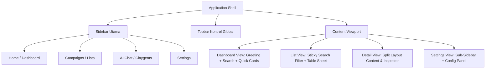

# CLAY IMPLEMENTATION PLAYBOOK
## Panduan Teknis & Arsitektur Visual Replikasi Clay UI

Playbook ini dirancang sebagai panduan praktis implementasi sistem desain Clay pada proyek web. Fokus utama dari dokumen ini adalah pemetaan tata letak (*layout layout*), cetak biru komponen (*component blueprints*), aturan pengambilan keputusan visual, serta konfigurasi Tailwind CSS untuk mereplikasi visual Clay secara presisi tanpa mengulang isi `CLAY-DESIGN-SYSTEM.md`.

---

# 1. SCREEN PATTERNS

Analisis pola layar yang digunakan di seluruh aplikasi Clay untuk mengorganisasi informasi dan interaksi:

### A. Dashboard Pattern
*   **Layout Structure**: 
    *   Header atas memuat sapaan personalisasi H1 dengan ukuran besar dan tebal, disertai input obrolan AI di sisi kanan.
    *   Kontainer utama terbagi menjadi grid kartu aksi cepat (2-4 kolom depending on viewport).
    *   Tepat di bawah grid kartu, terdapat area data tabel utama yang memuat daftar proyek/lembar kerja terakhir dengan pagination minimal.
*   **Hierarchy**: Sapaan Personal (H1) $\rightarrow$ Input AI Search (Aksi Utama) $\rightarrow$ Kartu Navigasi Cepat $\rightarrow$ Tabel Daftar Proyek Baru.
*   **Spacing**: 
    *   Wadah luar: `padding: 24px` (`p-6`).
    *   Jarak vertikal antar komponen utama: `32px` (`space-y-8`).
    *   Grid gap kartu: `16px` (`gap-4`).
*   **Composition Rules**: 
    *   Kartu aksi cepat tidak boleh memuat visual/ilustrasi yang mendominasi; hanya ikon monokrom berukuran `16px` atau `20px` dengan latar belakang berbentuk lingkaran abu-abu tipis.
    *   Gunakan gaya *Sunken Background* (`bg-nightshade-50`) untuk kanvas dasar, sementara setiap kartu dan panel tabel menggunakan latar belakang putih (`bg-white`).
*   **Interaction Flow**: 
    *   Klik pada kolom Input AI $\rightarrow$ fokus aktif dengan cincin biru halus, mengarahkan pengguna ke halaman AI chat secara instan begitu tombol *Submit* atau panah ditekan.
    *   Hover kartu $\rightarrow$ mengalami pergeseran vertikal ke atas (`-1px` atau `-2px`) dengan transisi halus `150ms`.

### B. List Pattern
*   **Layout Structure**:
    *   Header halaman berisi judul daftar, jumlah total entri, dan tombol aksi utama ("Create New").
    *   Baris pencarian dan baris filter tersemat di bawah header sebagai baris horizontal tunggal.
    *   Daftar item disusun secara vertikal dengan border pemisah bawah 1px di setiap baris item.
*   **Hierarchy**: Judul H2 (Kiri) & Tombol Aksi (Kanan) $\rightarrow$ Bilah Filter/Pencarian $\rightarrow$ Baris Daftar Item.
*   **Spacing**: 
    *   Jarak baris item: Tinggi baris tetap `48px` atau `56px`.
    *   Padding internal baris item: `12px 16px` (`px-4 py-3`).
    *   Gap filter chips: `8px` (`gap-2`).
*   **Composition Rules**:
    *   Setiap baris item wajib memuat struktur: Ikon Status/Avatar $\rightarrow$ Judul Item & Meta Ringkas (vertikal stack) $\rightarrow$ Aksi Cepat Hover (seperti tombol delete, duplicate yang hanya muncul saat baris di-hover).
*   **Interaction Flow**:
    *   Hover baris $\rightarrow$ Latar belakang baris berubah menjadi `bg-nightshade-50`. Muncul tombol aksi tersembunyi di ujung kanan baris.
    *   Klik baris $\rightarrow$ Membuka panel detail (Drawer) dari sisi kanan layar.

### C. Table Pattern
*   **Layout Structure**:
    *   Kepala kolom (`thead`) terkunci (sticky) di posisi atas.
    *   Baris data disusun rapat dengan batas grid tipis 1px horizontal dan vertikal.
    *   Pojok kiri bawah/kanan bawah memuat baris status jumlah data tersemat dan navigasi pagination.
*   **Hierarchy**: Header Tabel (Teks abu-abu semi-bold 12px) $\rightarrow$ Sel Teks Utama $\rightarrow$ Sel Metadata (Warna redup/mono) $\rightarrow$ Tombol Aksi Sel.
*   **Spacing**:
    *   Tinggi baris tetap: `34px`.
    *   Padding sel internal: `8px` horizontal (`px-2`), `4px` vertikal (`py-1`).
    *   Lebar kolom seleksi/checkbox: Tetap `32px` (`w-8`).
*   **Composition Rules**:
    *   Data numerik disejajarkan ke kanan (`text-right`), teks deskriptif ke kiri (`text-left`).
    *   Pemisah kolom menggunakan garis tipis `border-nightshade-200` (`#e6e8ec`). Tidak ada gradien pada header sel.
*   **Interaction Flow**:
    *   Klik checkbox header $\rightarrow$ menyeleksi seluruh baris dan mengubah warna latar belakang seluruh baris yang terpilih menjadi `bg-blueberry-100` (`#d7ebfe`).
    *   Klik sel $\rightarrow$ memicu status edit langsung (*inline edit*) jika jenis kolom memungkinkan penginputan teks.

### D. Detail Pattern
*   **Layout Structure**:
    *   Layout terbagi menjadi dua bagian tidak seimbang: Panel Konten Utama (Kiri - 70%) dan Panel Info Metadata/Inspektur (Kanan - 30%).
    *   Header atas memuat tombol kembali (*back button*), breadcrumbs, dan status indikator entri.
*   **Hierarchy**: Breadcrumbs $\rightarrow$ Judul Detail Utama $\rightarrow$ Tab Konten $\rightarrow$ Split Grid (Konten vs Inspector).
*   **Spacing**:
    *   Pemisah panel: `24px` (`gap-6`).
    *   Padding panel inspector: `16px` (`p-4`) dengan border pembatas kiri `border-l border-nightshade-200`.
*   **Composition Rules**:
    *   Panel Kanan (Inspector) dirancang statis dengan latar belakang sunken (`bg-nightshade-50`) untuk membedakan secara visual dari panel konten utama yang berwarna putih bersih.
*   **Interaction Flow**:
    *   Klik *tab switcher* di panel utama $\rightarrow$ konten di bawahnya berganti tanpa merubah visual panel inspektur di sebelah kanan.

### E. Workspace Pattern
*   **Layout Structure**:
    *   Layout lembar kerja penuh (*canvas layout*) di mana sidebar kiri dapat disembunyikan sepenuhnya.
    *   Area kerja terbagi atas: Toolbar Workspace (Atas) $\rightarrow$ Tab Tampilan Data (Tengah) $\rightarrow$ Lembar Data Spreadsheet Penuh (Bawah).
*   **Hierarchy**: Tombol Kolaborasi & Ekspor (Kanan Atas) $\rightarrow$ Toolbar Filter & Sortir $\rightarrow$ Spreadsheet Data Grid.
*   **Spacing**:
    *   Tinggi toolbar: `40px`.
    *   Jarak antar alat di toolbar: `12px` (`space-x-3`).
    *   Margin bawah toolbar: `8px` (`mb-2`).
*   **Composition Rules**:
    *   Seluruh elemen diatur dalam tata letak absolut agar tabel dapat menempati 100% tinggi sisa layar (*viewport minus toolbar height*).
*   **Interaction Flow**:
    *   Klik kanan pada baris/kolom $\rightarrow$ membuka menu dropdown kustom tepat di posisi kursor (*context menu*).

### F. Form Pattern
*   **Layout Structure**:
    *   Formulir disusun dalam kolom tunggal terpusat untuk menjaga fokus pengisian.
    *   Label teks diposisikan secara vertikal tepat di atas kontrol input.
*   **Hierarchy**: Sub-judul Form Section $\rightarrow$ Form Field (Label $\rightarrow$ Input $\rightarrow$ Deskripsi Bantuan/Error).
*   **Spacing**:
    *   Jarak antar grup input: `16px` (`space-y-4`).
    *   Jarak label ke input: `4px` (`mb-1`).
    *   Tinggi input: `32px` (`h-8`) untuk form padat, `36px` (`h-9`) untuk form standar.
*   **Composition Rules**:
    *   Tombol aksi (Submit/Cancel) diposisikan di sudut kanan bawah formulir. Tombol utama (Primary) diletakkan di paling kanan, tombol batal (Cancel/Ghost) di sebelah kirinya.
*   **Interaction Flow**:
    *   Fokus input $\rightarrow$ outline biru menyala, warna border berubah ke `border-blueberry-500`. 
    *   Jika validasi gagal $\rightarrow$ batas input menjadi `border-pomegranate-600` dan teks bantuan di bawahnya berubah menjadi merah.

### G. Wizard Pattern
*   **Layout Structure**:
    *   Header memuat progress bar tipis horizontal (tinggi 4px).
    *   Sisi kiri menampilkan navigasi langkah (*step list*) vertikal, sisi kanan berisi area formulir aktif langkah tersebut.
*   **Hierarchy**: Progress Stepper $\rightarrow$ Judul Langkah $\rightarrow$ Formulir Aktif $\rightarrow$ Footer Aksi Navigasi (Back/Next).
*   **Spacing**:
    *   Lebar kolom step list kiri: `200px`.
    *   Jarak vertikal antar item langkah: `12px`.
    *   Padding form langkah: `24px` (`p-6`).
*   **Composition Rules**:
    *   Langkah yang telah selesai ditandai dengan ikon centang hijau kecil (`text-matcha-600`). Langkah aktif ditandai dengan teks tebal biru.
*   **Interaction Flow**:
    *   Klik "Next" $\rightarrow$ memicu animasi transisi geser horizontal halus (fade-in-slide) pada kontainer form utama.

### H. Settings Pattern
*   **Layout Structure**:
    *   Struktur navigasi kiri tetap (Settings Sidebar) dan panel konten pengaturan di sisi kanan.
    *   Tidak menggunakan sidebar utama aplikasi; melainkan menindih layar dengan sub-level sidebar pengaturan khusus.
*   **Hierarchy**: Judul Pengaturan $\rightarrow$ Kategori Menu Pengaturan $\rightarrow$ Panel Form Konfigurasi.
*   **Spacing**:
    *   Lebar sidebar pengaturan: `220px`.
    *   Jarak horizontal ke konten: `32px` (`gap-8`).
    *   Grup pengaturan dipisahkan oleh border-t tipis dengan padding atas `24px`.
*   **Composition Rules**:
    *   Setiap kartu pengaturan memiliki judul H4 tebal dan deskripsi teks-muted (12px) di bawahnya untuk menjelaskan efek dari opsi tersebut.
*   **Interaction Flow**:
    *   Klik menu navigasi kiri $\rightarrow$ memicu transisi muatan cepat pada panel kanan dengan status loading skeleton tipis berdurasi 100ms.

### I. Modal Pattern
*   **Layout Structure**:
    *   Kotak dialog melayang di tengah layar yang menutup konten di bawahnya dengan scrim overlay gelap transparan.
*   **Hierarchy**: Scrim Latar $\rightarrow$ Kontainer Modal (Header $\rightarrow$ Body $\rightarrow$ Footer Aksi).
*   **Spacing**:
    *   Padding internal modal: `20px` (`p-5`) atau `24px` (`p-6`).
    *   Radius sudut kontainer modal: `8px` (`rounded-lg`).
*   **Composition Rules**:
    *   Wajib memiliki tombol tutup silang (Close 'X') di sudut kanan atas header modal.
    *   Batas bawah header dan batas atas footer modal dipisahkan dengan garis tipis `border-nightshade-100` (#eff1f3).
*   **Interaction Flow**:
    *   Menekan tombol `Esc` atau mengklik di luar area modal (pada scrim) $\rightarrow$ memicu animasi fade-out modal dan menutup jendela dialog.

### J. Drawer Pattern
*   **Layout Structure**:
    *   Panel vertikal penuh yang meluncur masuk dari sisi kanan layar.
*   **Hierarchy**: Scrim Latar $\rightarrow$ Kontainer Panel (Header $\rightarrow$ Area Scroll Konten $\rightarrow$ Footer Lengket).
*   **Spacing**:
    *   Lebar panel default: `400px` atau `480px`.
    *   Padding konten: `24px` (`p-6`).
*   **Composition Rules**:
    *   Bagian footer drawer harus bersifat melayang/lengket (*sticky/fixed*) di bagian bawah agar tombol aksi utama selalu terlihat saat konten di-scroll.
*   **Interaction Flow**:
    *   Klik trigger $\rightarrow$ drawer masuk dengan efek geser dari kanan ke kiri (`translate-x-0` dari `translate-x-full`) selama `200ms` dengan fungsi transisi `ease-out`.

---

# 2. MASTER LAYOUT FORMULA

Berikut adalah ukuran pasti dimensi tata letak Clay UI yang harus diimplementasikan secara ketat:

| Elemen Layout | Ukuran Piksel (PX) | Nilai Rem / Tailwind Class | Penerapan & Aturan Penataan |
| :--- | :--- | :--- | :--- |
| **Sidebar Width (Expanded)** | `256px` | `w-64` / `16rem` | Lebar penuh menu navigasi utama sebelah kiri |
| **Sidebar Width (Collapsed)**| `48px` | `w-12` / `3rem` | Lebar minimal menu kiri (hanya menampilkan ikon) |
| **Navbar Height** | `48px` | `h-12` / `3rem` | Tinggi bar navigasi atas global |
| **Page Padding** | `24px` | `p-6` / `1.5rem` | Padding luar container halaman utama |
| **Section Spacing** | `32px` | `space-y-8` / `2rem` | Jarak antar kelompok grup konten vertikal |
| **Card Spacing** | `16px` | `gap-4` / `1rem` | Jarak celah antar kartu dalam layout grid |
| **Card Padding** | `16px` / `24px` | `p-4` / `p-6` | Padding internal kartu (data vs dashboard) |
| **Table Row Height** | `34px` | Kustom (`h-[34px]`) | Tinggi baris data sel tabel spreadsheet |
| **Table Header Height** | `34px` | Kustom (`h-[34px]`) | Tinggi baris judul kolom tabel |
| **Form Row Spacing** | `16px` | `space-y-4` / `1rem` | Jarak vertikal antar baris kontrol formulir |
| **Input Height** | `32px` / `36px` | `h-8` / `h-9` | Tinggi elemen input teks & select dropdown |
| **Button Height** | `28px` / `32px` | `h-7` / `h-8` | Tinggi tombol aksi (mini vs standar) |
| **Modal Width (Medium)** | `512px` | `max-w-lg` / `32rem` | Lebar standar dialog pop-up konfirmasi / form |
| **Drawer Width (Standard)** | `480px` | `w-[480px]` / `30rem` | Lebar standar panel geser informasi dari kanan |

---

# 3. COMPONENT BLUEPRINTS

### A. Button
*   **Anatomy**: `[Icon Left (Optional)] + [Teks Label] + [Icon Right/Chevron (Optional)]` dibungkus dalam tag `<button>`.
*   **Size Variants**:
    *   *Mini (h-7)*: Ukuran teks 12px (`text-xs`), padding `px-2 py-0.5`.
    *   *Standard (h-8)*: Ukuran teks 14px (`text-sm`), padding `px-3 py-1`.
    *   *Large (h-9)*: Ukuran teks 14px (`text-sm`), padding `px-4 py-1.5`.
*   **Spacing**: Jarak ikon ke teks label: `6px` (`gap-x-1.5`).
*   **Typography**: `font-medium` (500) atau `font-semibold` (600) menggunakan font-family Inter.
*   **Radius**: `rounded-md` (6px) untuk standard, `rounded` (4px) untuk mini.
*   **Colors & States**:
    *   *Primary*: Latar `#0382f7`, Teks `#ffffff`. Hover: `#0667d9`. Focus: outline ring warna `#d7ebfe`. Disabled: opacity 50%, pointer-events-none.
    *   *Secondary*: Latar `#ffffff`, Teks `#16181f`, Border `1px solid #d6d9df`. Hover: Latar `#f7f8f9`. Focus: outline ring tipis. Disabled: Teks `#979da9`, Latar `#f7f8f9`.
    *   *Ghost*: Latar transparan, Teks `#3c414d`. Hover: Latar `#16181f0d` (opacity 5%). Active: Latar `#16181f12` (opacity 7%).

### B. Input
*   **Anatomy**: Kontainer luar pembungkus input $\rightarrow$ `[Ikon Kiri (Optional)] + [Tag <input>] + [Ikon/Tombol Kanan (Optional)]`.
*   **Size Variants**:
    *   *Compact*: Tinggi `32px` (`h-8`), teks `text-sm`, padding horizontal `px-2.5`.
    *   *Standard*: Tinggi `36px` (`h-9`), teks `text-sm`, padding horizontal `px-3`.
*   **Spacing**: Gap internal ikon ke teks input: `8px`.
*   **Typography**: `font-normal` (400) untuk nilai input, `font-medium` (500) untuk placeholder teks.
*   **Radius**: `rounded-md` (6px).
*   **Colors & States**:
    *   *Default*: Latar `#ffffff` atau transparan, border `1px solid #d6d9df`, teks `#16181f`, placeholder `#979da9`.
    *   *Hover*: Border `#979da9`.
    *   *Focus*: Border `#0382f7`, ring outline luar `2px solid #ecf6ff` (tidak menggunakan shadow gelap).
    *   *Disabled*: Latar `#f7f8f9`, border `#e6e8ec`, teks `#979da9`, pointer-events-none.

### C. Select
*   **Anatomy**: Kontainer kustom $\rightarrow$ `[Tag <select>] + [Ikon Chevron Down Absolut Kanan]`.
*   **Size Variants**:
    *   Tinggi `32px` (`h-8`) atau `36px` (`h-9`).
*   **Spacing**: Padding kanan minimal `32px` (`pr-8`) untuk memberi ruang bagi ikon chevron agar tidak bertumpuk dengan teks opsi.
*   **Typography**: `text-sm`, `font-normal` (400).
*   **Radius**: `rounded-md` (6px).
*   **Colors & States**:
    *   *Default*: Latar `#ffffff`, border `1px solid #d6d9df`, teks `#16181f`, ikon warna `#525a69`.
    *   *Hover/Focus*: Sama dengan aturan input teks.
    *   *Disabled*: Latar `#f7f8f9`, teks `#979da9`.

### D. Textarea
*   **Anatomy**: Tag `<textarea>` mandiri yang dapat di-resize secara vertikal (`resize-y`).
*   **Size Variants**: Min-height `80px` (`h-20`).
*   **Spacing**: Padding internal: `px-3 py-2` (12px horizontal, 8px vertikal).
*   **Typography**: `text-sm`, `font-normal`.
*   **Radius**: `rounded-md` (6px).
*   **Colors & States**: Mengikuti aturan styling dan state perubahan warna pada komponen **Input**.

### E. Checkbox
*   **Anatomy**: Tag `<input type="checkbox">` kustom yang dibungkus label.
*   **Size Variants**: Ukuran konstan `16px` (`size-4`).
*   **Spacing**: Margin kanan ke teks label pendamping: `8px` (`mr-2`).
*   **Typography**: Label teks pendamping: `text-sm`, `font-medium` (500).
*   **Radius**: `rounded` (4px).
*   **Colors & States**:
    *   *Default*: Latar `#ffffff`, border `1px solid #d6d9df`.
    *   *Hover*: Border `#0382f7`.
    *   *Checked*: Latar `#0382f7`, border `#0382f7`, ikon centang dalam putih bersih.
    *   *Focus*: Ring outline tipis biru Blueberry-50 (`#ecf6ff`).

### F. Radio
*   **Anatomy**: Tag `<input type="radio">` kustom berbentuk lingkaran.
*   **Size Variants**: Ukuran konstan `16px` (`size-4`).
*   **Spacing**: Margin kanan ke teks label pendamping: `8px` (`mr-2`).
*   **Radius**: `rounded-full` (9999px).
*   **Colors & States**:
    *   *Default*: Latar `#ffffff`, border `1px solid #d6d9df`.
    *   *Hover*: Border `#0382f7`.
    *   *Checked*: Latar `#ffffff`, border `#0382f7`, memicu dot biru terpusat di tengah lingkaran dengan ukuran 8px.

### G. Badge
*   **Anatomy**: Wadah inline `<span>` $\rightarrow$ `[Dot Indikator/Ikon (Optional)] + [Teks Badge]`.
*   **Size Variants**:
    *   *Standard*: Tinggi `20px` (`h-5`), teks `text-xs`, padding `px-2 py-0.5`.
*   **Spacing**: Jarak dot indikator ke teks badge: `4px` (`gap-1`).
*   **Typography**: `font-semibold` (600), tracking-wide.
*   **Radius**: `rounded-full` (9999px) untuk status pill, `rounded` (4px) untuk tag label kategori.
*   **Colors & States**:
    *   *Matcha (Success)*: Latar `#eefff1`, Teks `#078a52`.
    *   *Tangerine (Warning)*: Latar `#fff3ed`, Teks `#c34e1b`.
    *   *Pomegranate (Danger/Error)*: Latar `#fff1f2`, Teks `#dd2c53`.
    *   *Blueberry (Info/Interactive)*: Latar `#ecf6ff`, Teks `#0667d9`.

### H. Card
*   **Anatomy**: Blok container `<div>` $\rightarrow$ `[Card Header] + [Card Body] + [Card Footer]`.
*   **Size Variants**: Fleksibel tergantung isi grid konten.
*   **Spacing**: Padding dalam `16px` (`p-4`) atau `24px` (`p-6`). Gap vertikal antar section dalam kartu: `12px` (`space-y-3`).
*   **Typography**: Title: `text-base` (16px), `font-semibold`. Description: `text-sm`, `text-nightshade-700`.
*   **Radius**: `rounded-lg` (8px).
*   **Colors & States**:
    *   *Default*: Latar `#ffffff`, border `1px solid #e6e8ec`, shadow `0 1px 3px 0 rgba(0,0,0,0.05)`.
    *   *Hover (Interactive Card)*: Border `#d6d9df`, shadow `0 4px 6px -1px rgba(0, 0, 0, 0.05)`, translateY naik `1px` (`-translate-y-[1px]`).

### I. Table
*   **Anatomy**: Tag `<table>` $\rightarrow$ `<thead>` & `<tbody>` $\rightarrow$ `<tr>` $\rightarrow$ `<th>` / `<td>`.
*   **Size Variants**: Tinggi baris konstan `34px`.
*   **Spacing**: Sel padding `px-2 py-1` (8px horizontal, 4px vertikal).
*   **Typography**: Header th: `text-xs` (12px), `font-semibold` (600), teks warna `#525a69`. Sel td: `text-sm` (14px), `font-normal` (400), teks warna `#16181f`.
*   **Radius**: Tidak ada radius pada sel tabel (selalu sudut lancip untuk menjamin kerapatan grid).
*   **Colors & States**:
    *   *Header Background*: `#f7f8f9` (`bg-nightshade-50`) dengan border bawah `#d6d9df`.
    *   *Row Hover*: Latar `#f7f8f9`.
    *   *Row Selected*: Latar `#d7ebfe` (`bg-blueberry-100`) secara permanen selama status checkbox tercentang.

### J. Tabs
*   **Anatomy**: Blok nav horizontal `<nav>` $\rightarrow$ kumpulan elemen `<button role="tab">` yang disejajarkan.
*   **Size Variants**: Tinggi area tab `36px` atau `40px`.
*   **Spacing**: Jarak antar tombol tab: `16px` (`space-x-4`). Padding tombol tab: `pb-2` (8px bawah).
*   **Typography**: `text-sm`, `font-medium` (500).
*   **Radius**: Tanpa radius (menggunakan garis bawah penanda aktif).
*   **Colors & States**:
    *   *Inactive*: Teks `#525a69`, tanpa border bawah. Hover: Teks `#16181f`.
    *   *Active*: Teks `#0382f7`, border-bottom `2px solid #0382f7`.

### K. Modal
*   **Anatomy**: `<div class="fixed inset-0 Scrim">` $\rightarrow$ `<div class="ModalContainer">` $\rightarrow$ Header, Body, Footer.
*   **Size Variants**: `max-w-md` (448px), `max-w-lg` (512px), `max-w-2xl` (640px).
*   **Spacing**: Outer modal padding: `24px` (`p-6`). Header-to-body margin: `16px` (`mb-4`).
*   **Typography**: Title: `text-lg` (18px), `font-semibold`, teks `#16181f`. Body: `text-sm`, `#3c414d`.
*   **Radius**: `rounded-lg` (8px).
*   **Colors & States**: Scrim: `#16181f80` (50% opacity). Container: Latar `#ffffff`, shadow `--shadow-modal`.

### L. Drawer
*   **Anatomy**: Jendela melayang `<div class="fixed inset-y-0 right-0 Container">` $\rightarrow$ Header, Scrollable Body, Sticky Footer.
*   **Size Variants**: Lebar tetap `400px` atau `480px`.
*   **Spacing**: Padding internal: `24px` (`p-6`).
*   **Typography**: Sama dengan spesifikasi **Modal**.
*   **Radius**: Sudut kiri atas dan kiri bawah memiliki radius `rounded-l-lg` (8px), sudut kanan menempel pas ke dinding layar (0px).
*   **Colors & States**: Container: Latar `#ffffff`, border kiri `1px solid #d6d9df`, shadow pekat di sisi kiri.

### M. Tooltip
*   **Anatomy**: Kotak kecil melayang di atas trigger $\rightarrow$ `[Teks Tooltip]`.
*   **Size Variants**: Sangat ringkas, tinggi max `24px`.
*   **Spacing**: Padding internal `px-2 py-1` (8px horizontal, 4px vertikal).
*   **Typography**: `text-xs` (12px), `font-normal` (400).
*   **Radius**: `rounded` (4px).
*   **Colors & States**: Latar `#16181f` (hitam pekat), Teks `#ffffff`, tanpa border. Muncul seketika (delay 300ms) saat hover.

### N. Dropdown
*   **Anatomy**: Kontainer menu absolut $\rightarrow$ kumpulan tag `<button role="menuitem">` disusun vertikal.
*   **Size Variants**: Min-width `160px` (`w-40`), max-width `240px`.
*   **Spacing**: Padding item dropdown: `px-3 py-1.5` (12px horizontal, 6px vertikal). Gap vertikal antar menu item: `2px` (`space-y-0.5`).
*   **Typography**: `text-sm`, `font-normal` (400), warna teks `#16181f`.
*   **Radius**: `rounded-md` (6px).
*   **Colors & States**: Latar `#ffffff`, border `1px solid #e6e8ec`, shadow `0 4px 6px -1px rgba(0,0,0,0.1)`. Item Hover: Latar `#f7f8f9` (`bg-nightshade-50`), Teks `#000000`.

### O. Toast
*   **Anatomy**: Panel notifikasi kecil $\rightarrow$ `[Ikon Status] + [Pesan Deskripsi] + [Tombol Tutup Silang]`.
*   **Size Variants**: Lebar tetap `320px` (`w-80`).
*   **Spacing**: Padding internal `px-4 py-3`. Diposisikan `24px` dari batas bawah dan kanan layar (`bottom-6 right-6`).
*   **Typography**: Teks pesan: `text-sm`, `font-medium` (500).
*   **Radius**: `rounded-lg` (8px).
*   **Colors & States**: Latar `#16181f` (hitam pekat), Teks `#ffffff`, ikon status (Hijau Matcha untuk sukses, Merah Pomegranate untuk gagal), shadow pekat `--shadow-popover`.

---

# 4. INFORMATION ARCHITECTURE

Clay mengatur hierarki informasi secara logis dan terstruktur untuk memisahkan navigasi global, area manipulasi data, dan konfigurasi sistem.

### Struktur Organisasi Halaman



*   **Navigation Hierarchy**: Navigasi global dikunci di Sidebar sebelah kiri. Menu sekunder dipindahkan ke area in-page tab atau sub-sidebar khusus (seperti di halaman Settings).
*   **Dashboard Layout**: Tempat penampungan status ringkas, kredit penggunaan akun, pintasan template kerja, dan pencarian AI terpadu.
*   **List Pages Layout**: Menggunakan skema spreadsheet-first. Seluruh entri utama ditampilkan dalam baris tabel padat data dengan baris filter lengket di bagian atas.
*   **Detail Pages Layout**: Menerapkan split-layout 2-kolom. Pengguna dapat membaca data mendalam di sebelah kiri sambil tetap melihat meta-data pelengkap di sebelah kanan.
*   **Editing Pages Layout**: Mengutamakan modifikasi langsung di tempat (*inline editing*) pada tabel sheet. Formulir edit dedikasi hanya digunakan untuk perubahan data konfigurasi tinggi.
*   **Settings Pages Layout**: Membagi pengaturan akun, anggota tim, dan integrasi API ke dalam tab navigasi vertikal di sisi kiri halaman settings.

---

### Pola Alur Hubungan Data (Relationship Patterns)

#### Pola 1: Penelusuran Entri (Sidebar $\rightarrow$ List $\rightarrow$ Detail $\rightarrow$ Action)
Pola ini digunakan untuk eksplorasi dan eksekusi pada koleksi data (contoh: mengelola dokumen PBB):

```
[Sidebar Menu] 
    └── Klik menu "Daftar Permohonan" (Membuka List Page)
          └── [List Page] 
                  ├── Menampilkan tabel ribuan permohonan (Tinggi baris 34px)
                  ├── Pengguna melakukan pencarian & memfilter data secara cepat
                  └── Klik satu baris permohonan (Membuka Detail View)
                        └── [Detail Drawer / Page]
                                ├── Muncul panel dari kanan (Drawer 480px)
                                ├── Menampilkan metadata lengkap permohonan
                                └── [Action Area]
                                        └── Tombol eksekusi: "Approve", "Reject", "Re-route"
```

#### Pola 2: Alur Lembar Kerja AI (Sidebar $\rightarrow$ Dashboard $\rightarrow$ Workspace $\rightarrow$ Data)
Pola ini digunakan untuk analisis data cerdas dan pemrosesan otomatis (contoh: AI chat & asisten data):

```
[Sidebar Menu] 
    └── Klik menu "Home" (Membuka Dashboard)
          └── [Dashboard Page]
                  ├── Sapaan "Hey [User], ready to get started?"
                  ├── Input teks obrolan AI: "Tolong analisis berkas PBB..."
                  └── Klik panah submit (Membuka Workspace AI)
                        └── [Workspace / AI Chat Page]
                                ├── Membuka chat interface responsif
                                ├── AI memproses instruksi & menampilkan visual tabel data
                                └── [Data Interaction]
                                        └── Mengedit data hasil AI langsung di baris tabel
```

---

# 5. DESIGN DECISION RULES

Aturan baku pemilihan komponen visual untuk diimplementasikan secara konsisten pada seluruh alur aplikasi:

### A. Card vs Table
*   **Pilih Table jika**:
    *   Pengguna perlu membandingkan nilai beberapa kolom di antara puluhan entri sekaligus.
    *   Tugas utama pengguna melibatkan pencarian masal, pengurutan abjad/angka, dan penyaringan data (*filtering*).
    *   Data bersifat homogen dengan atribut/kolom yang seragam (misal: Daftar Dokumen PBB, Log Audit).
*   **Pilih Card jika**:
    *   Entri data berjumlah sedikit (< 10) atau berbentuk ringkasan informasi eksekutif.
    *   Data bersifat heterogen dengan jenis informasi yang bervariasi secara signifikan antar entri.
    *   Perlu menampilkan visual pendukung seperti ikon besar, grafik tren kecil, atau tombol aksi cepat yang berbeda-beda.
    *   *Rule*: Maksimal 3-4 kartu dalam satu baris grid horizontal pada layar desktop.

### B. Modal vs Drawer
*   **Pilih Modal jika**:
    *   Aksi yang dilakukan bersifat interuptif, membutuhkan perhatian 100% dari pengguna, dan harus diselesaikan segera (misal: konfirmasi hapus permanen, form pembuatan folder baru).
    *   Pengguna tidak memerlukan informasi kontekstual yang ada di layar utama untuk menyelesaikan tindakan di dalam dialog.
*   **Pilih Drawer jika**:
    *   Pengguna sedang meninjau detail mendalam dari suatu entri dan masih membutuhkan visual halaman daftar di bawahnya sebagai referensi konteks.
    *   Formulir input memiliki field yang sangat banyak/panjang secara vertikal (Drawer menyediakan area scroll vertikal yang lebih nyaman daripada modal).
    *   Aksi bersifat eksploratif (misal: membaca riwayat perubahan data baris tertentu).

### C. Tabs vs Separate Page
*   **Pilih Tabs jika**:
    *   Berada dalam konteks entri yang sama namun ingin melihat sudut pandang/tipe visualisasi data yang berbeda (misal: mengubah tampilan daftar dokumen dari Table view ke Kanban board view).
    *   Konten di setiap tab dapat dimuat dengan cepat tanpa perlu melakukan refresh data global atau query API yang berat.
*   **Pilih Separate Page jika**:
    *   Pengguna berpindah ke area fungsionalitas yang sama sekali baru (misal: dari halaman analisis data dokumen berpindah ke Halaman Obrolan AI).
    *   Struktur layout halaman berubah total (misalnya dari layout tabel spreadsheet lebar penuh ke layout percakapan chat terpusat).

### D. Inline Edit vs Dedicated Form
*   **Pilih Inline Edit jika**:
    *   Perubahan hanya dilakukan pada satu bidang teks tunggal atau status boolean (misal: mengubah nama kampanye, mengganti status verifikasi).
    *   Kecepatan input data adalah prioritas utama (seperti mengoreksi nilai bidang di tabel sheet).
*   **Pilih Dedicated Form jika**:
    *   Modifikasi data membutuhkan logika validasi silang antar bidang (*cross-field validation*) yang kompleks.
    *   Kesalahan input dapat merusak pipeline sistem (memerlukan tombol "Save Changes" dan "Cancel" yang eksplisit sebagai pengaman).
    *   Input data terdiri dari beberapa langkah berurutan (*multi-step*).

### E. Dropdown vs Popover
*   **Pilih Dropdown jika**:
    *   Hanya menampilkan daftar pilihan aksi teks sederhana atau daftar opsi select linear (misal: "Edit", "Duplicate", "Delete").
    *   Tidak memuat input teks, formulir, atau elemen interaktif kompleks lain di dalam jendelanya.
*   **Pilih Popover jika**:
    *   Perlu menampilkan kontrol interaktif mini di dalam jendela melayang (misal: panel pengaturan filter kolom yang memuat pencarian kustom, checkbox, dan tombol apply).
    *   Memuat penjelasan dokumentasi/bantuan yang panjang beserta link rujukan.

---

# 6. PAGE COMPOSITION RULES

Formula susunan grid dan komponen untuk tipe-tipe halaman standar aplikasi:

### A. Dashboard Page
*   **Layout Wrapper**: `w-full max-w-8xl mx-auto p-6 space-y-8 bg-nightshade-50 min-h-screen`
*   **Row 1 (Personal Welcome)**: Flexbox horizontal. Kiri: sapaan Roobert H1 `text-2xl font-bold tracking-[-0.55px] text-black`. Kanan: Profil avatar & widget sisa kredit limitasi akun.
*   **Row 2 (AI Assistant Bar)**: Kontainer putih penuh `bg-white rounded-lg border border-nightshade-200 p-4 shadow-sm flex items-center`. Input field tanpa border dengan tombol submit panah biru Blueberry-500 di sebelah kanan.
*   **Row 3 (Quick Actions Grid)**: Grid 4-kolom (`grid grid-cols-1 md:grid-cols-4 gap-4`). Setiap item berupa kartu putih interaktif `rounded-lg border border-nightshade-200 p-4 hover:-translate-y-0.5 transition-all duration-150`.
*   **Row 4 (Main Data Section)**: Kartu putih besar `bg-white rounded-lg border border-nightshade-200 p-6`. Memuat sub-header H3 `text-base font-semibold mb-4` dan Table komponen daftar proyek.

### B. List Page
*   **Layout Wrapper**: `flex flex-col flex-1 min-w-0 bg-white min-h-screen`
*   **Header Bar**: Tinggi `56px` (`h-14`), border bawah `#e6e8ec`. Memuat breadcrumbs, judul halaman tebal (18px), dan tombol primary action di sisi kanan.
*   **Filter Control Bar**: Tinggi `40px` (`h-10`), `bg-nightshade-50` border bawah `#e6e8ec`. Memuat input pencarian ikon kiri, filter chips dropdown, dan tombol sorting.
*   **Data Sheet Area**: `flex-1 overflow-auto`. Memuat Table dengan tinggi baris data dikunci `34px`.

### C. Detail Page
*   **Layout Wrapper**: `flex flex-col flex-1 min-w-0 bg-white min-h-screen`
*   **Header Navigation**: `h-12 border-b border-nightshade-200 flex items-center px-6 gap-4`. Tombol kembali berbentuk ikon chevron kiri $\rightarrow$ judul detail entri.
*   **Split Pane**: `grid grid-cols-10 flex-1 overflow-hidden`.
    *   *Left Pane (Content)*: Col-span 7, `overflow-y-auto p-6`. Memuat tab in-page, kartu-kartu isi informasi utama.
    *   *Right Pane (Inspector)*: Col-span 3, `border-l border-nightshade-200 bg-nightshade-50 p-6 overflow-y-auto`. Memuat grup metadata vertikal.

### D. Create Page
*   **Layout Wrapper**: `w-full max-w-2xl mx-auto py-12 px-6 bg-white min-h-screen`
*   **Header Section**: `mb-8`. Tombol kembali teks abu-abu $\rightarrow$ Judul H2 tebal `text-xl font-bold mt-2`.
*   **Form Container**: `space-y-6`. Kelompok bidang input dibungkus pembatas tipis.
*   **Action Footer**: `border-t border-nightshade-200 pt-6 flex justify-end gap-3`. Tombol Batal (Secondary) di kiri, Tombol Buat (Primary) di kanan.

### E. Edit Page
*   **Layout Wrapper**: `flex flex-col flex-1 bg-nightshade-50 min-h-screen`
*   **Layout Split**: `flex flex-row flex-1`.
    *   *Sidebar Edit Menu*: Navigasi vertikal kiri lebar `200px` berisi kategori edit (General, Security, API Keys).
    *   *Edit Form Content*: Area kanan `flex-1 bg-white p-8 border-l border-nightshade-200`. Memuat form edit sesuai menu aktif.

### F. Settings Page
*   **Layout Wrapper**: `w-full max-w-6xl mx-auto p-6 space-y-6 bg-white`
*   **Page Title**: `text-xl font-bold tracking-tight text-black mb-6`.
*   **Two-Column Split**: `flex flex-col md:flex-row gap-8`.
    *   *Nav Sidebar*: Lebar `220px` flex-shrink-0. Menu list vertical dengan link transisi halus.
    *   *Settings Panel*: `flex-1 max-w-3xl space-y-8`. Setiap seksi konfigurasi dipisahkan oleh border-b tipis.

### G. Analytics Page
*   **Layout Wrapper**: `w-full max-w-8xl mx-auto p-6 space-y-6 bg-nightshade-50`
*   **Summary Cards Row**: Grid 3-kolom (`grid grid-cols-1 md:grid-cols-3 gap-6`). Memuat kartu KPI: Angka besar `text-2xl font-bold` + Label kecil `text-xs text-nightshade-700` + Tren persentase berwarna hijau/merah.
*   **Chart Grid Section**: Grid 2-kolom (`grid grid-cols-1 lg:grid-cols-2 gap-6`). Kartu grafik visual terbungkus `bg-white rounded-lg border border-nightshade-200 p-6 h-80`.
*   **Audit List Row**: Kartu putih lebar penuh memuat tabel log transaksi di bawah visual chart.

### H. Approval Workflow Page
*   **Layout Wrapper**: `flex flex-col flex-1 bg-white min-h-screen`
*   **Split Approval Screen**: `grid grid-cols-12 flex-1`.
    *   *Left Timeline (Step List)*: Col-span 3, `bg-nightshade-50 p-6 border-r border-nightshade-200`. Menampilkan step visual persetujuan vertikal (Pending, Approved, Rejected).
    *   *Center Document Preview*: Col-span 6, `p-6 overflow-y-auto`. File viewer atau dokumen JSON yang perlu direview.
    *   *Right Action Sidebar*: Col-span 3, `bg-nightshade-50 p-6 border-l border-nightshade-200 flex flex-col justify-between`. Atas: Form komentar penolakan/catatan. Bawah: Sticky buttons (Reject `#dd2c53` & Approve `#0382f7`).

---

# 7. TAILWIND MAPPING GUIDE

Konfigurasikan file `tailwind.config.js` dengan memetakan seluruh token desain Clay agar proses koding berjalan konsisten dan cepat:

### A. Tailwind Colors Config
Tambahkan warna-warna khusus ini ke dalam objek `theme.extend.colors`:

```javascript
colors: {
  // Kanvas & Neutral
  black: '#000000',
  white: '#ffffff',
  nightshade: {
    50: '#f7f8f9',
    100: '#eff1f3',
    200: '#e6e8ec',
    300: '#d6d9df',
    500: '#979da9',
    700: '#525a69',
    800: '#3c414d',
    950: '#16181f',
  },
  oat: {
    50: '#fffcfa',
    100: '#f9f8f6',
    200: '#f3f2ed',
    500: '#c0bbaf',
    950: '#1b1a18',
  },
  // Akses & Interaktif Utama
  blueberry: {
    50: '#ecf6ff',
    100: '#d7ebfe',
    500: '#0382f7',
    600: '#0667d9',
  },
  ube: {
    50: '#f5f3ff',
    500: '#8b5cf6',
    600: '#7934f0',
  },
  dragonfruit: {
    500: '#ff7ad5',
    600: '#ff52c2',
  },
  slushie: {
    500: '#3bd3fd',
    600: '#2abeea',
  },
  // Status Feedback
  matcha: {
    50: '#eefff1',
    500: '#0dac65',
    600: '#078a52',
    700: '#02693e',
  },
  tangerine: {
    50: '#fff3ed',
    500: '#f58c50',
    700: '#c34e1b',
  },
  lemon: {
    50: '#fefae8',
    500: '#f6c23d',
    800: '#b37601',
  },
  pomegranate: {
    50: '#fff1f2',
    500: '#e94d68',
    600: '#dd2c53',
    700: '#b21a3f',
  }
}
```

### B. Tailwind Spacing Config
Gunakan pemetaan skala spacing standar Tailwind yang disesuaikan dengan ritme grid 4px Clay:

*   `1` $\rightarrow$ `4px` (`0.25rem`)
*   `2` $\rightarrow$ `8px` (`0.5rem`)
*   `3` $\rightarrow$ `12px` (`0.75rem`)
*   `4` $\rightarrow$ `16px` (`1rem`)
*   `5` $\rightarrow$ `20px` (`1.25rem`)
*   `6` $\rightarrow$ `24px` (`1.5rem`)
*   `8` $\rightarrow$ `32px` (`2rem`)
*   `12` $\rightarrow$ `48px` (`3rem`)
*   `16` $\rightarrow$ `64px` (`4rem`)
*   `24` $\rightarrow$ `96px` (`6rem`)

### C. Tailwind Radius Config
Konfigurasikan radius sudut pada objek `theme.extend.borderRadius`:

```javascript
borderRadius: {
  'xs': '2px',     // Checkbox, status indicators
  'sm': '4px',     // Compact buttons, filter chips
  'md': '6px',     // Standard buttons, input fields
  'lg': '8px',     // Cards, dialog modals, drawers
  'xl': '12px',    // Big promo cards, popup alerts
  '2xl': '16px',   // Large badges, user profile avatars
}
```

### D. Tailwind Shadows Config
Konfigurasikan efek kedalaman visual pada objek `theme.extend.boxShadow`:

```javascript
boxShadow: {
  'xs': '0 1px 2px 0 rgba(0, 0, 0, 0.05)',
  'sm': '0 1px 3px 0 rgba(0, 0, 0, 0.1), 0 1px 2px -1px rgba(0, 0, 0, 0.1)',
  'md': '0px 2px 4px -2px rgba(0, 0, 0, 0.04), 0px 4px 6px -1px rgba(0, 0, 0, 0.08)',
  'lg': '0px 0px 6px 5px rgba(0, 0, 0, 0.05), 0px 10px 15px -3px rgba(0, 0, 0, 0.05)',
  'popover': '0 0 1px rgba(0, 0, 0, 0.5), 0 8px 16px rgba(0, 0, 0, 0.15)',
  'modal': '0 0 1px rgba(0, 0, 0, 0.5), 0 20px 40px rgba(0, 0, 0, 0.3)',
}
```

### E. Tailwind Typography Config
Gunakan pemetaan font-family pada objek `theme.extend.fontFamily`:

```javascript
fontFamily: {
  sans: ['"Inter var"', 'ui-sans-serif', 'system-ui', 'sans-serif'],
  display: ['"Roobert"', 'ui-sans-serif', 'system-ui', 'sans-serif'],
  mono: ['ui-monospace', 'Menlo', 'Monaco', 'Consolas', 'monospace'],
}
```

*   *Rule Letter Spacing*: Gunakan kelas kustom `tracking-[-0.55px]` untuk H1/sapaan besar, `tracking-tight` (`-0.025em`) untuk H2/H3, dan `tracking-normal` untuk running teks data.

---

# 8. IMPLEMENTATION RULES FOR AI

Ketika AI melakukan redesain visual pada halaman-halaman aplikasi, aturan-aturan berikut bersifat mutlak dan tidak boleh dilanggar.

### WAJIB (MUST DO):
1.  **Menggunakan Warna Token**: Setiap warna latar belakang, batas, teks, dan ikon harus merujuk ke palet warna di playbook ini (misal: `bg-nightshade-50` untuk canvas, `border-nightshade-200` untuk pembatas, `text-blueberry-600` untuk tautan aktif).
2.  **Menggunakan Spacing Skala**: Penentuan margin, padding, dan grid gap wajib menggunakan kelas kelipatan standar (seperti `p-4`, `p-6`, `gap-4`). Dilarang keras menulis padding kustom tak teratur seperti `p-[19px]` atau `m-[7px]`.
3.  **Menggunakan Radius Sistem**: Sudut elemen harus dibatasi sesuai tabel radius (input wajib `rounded-md`, kartu wajib `rounded-lg`, checkbox wajib `rounded`).
4.  **Mempertahankan Kepadatan Data**: Halaman tabel harus memiliki tinggi baris data `34px` dengan padding minimal agar data terbaca maksimal dalam satu layar tanpa banyak scrolling.
5.  **Menyelaraskan Grid Col**: Header kolom tabel dan sel baris data di bawahnya harus sejajar secara matematis (Gunakan CSS Grid atau flexbox dengan lebar persentase/pixel yang dikunci sama).

### DILARANG (MUST NOT DO):
1.  **Membuat Warna Baru**: Jangan pernah membuat warna hex baru yang berada di luar dokumentasi palet warna (seperti warna merah ungu mencolok, hijau neon, atau gradien kuning-oranye tebal).
2.  **Membuat Spacing Kustom**: Jangan menggunakan nilai margin/padding sewenang-wenang yang merusak ritme vertikal 4px.
3.  **Membuat Radius Kustom**: Jangan menggunakan sudut membulat ekstrem pada tombol (seperti tombol berbentuk pill penuh oval `rounded-full` kecuali untuk badge khusus).
4.  **Membuat Efek Bayangan Gelap**: Dilarang menggunakan bayangan drop-shadow hitam tebal (`shadow-2xl` pekat) yang merusak estetika desain datar minimalis Clay.
5.  **Membuat Hierarki Teks Baru**: Dilarang mencampur font-display (Roobert) di dalam sel tabel atau label input. Font-display hanya diizinkan untuk H1/H2 judul utama halaman.

---

# 9. CLAY SIMILARITY CHECKLIST

Gunakan checklist audit visual ini untuk mengukur sejauh mana kemiripan antarmuka aplikasi hasil redesain dengan standar visual Clay UI:

### [ ] Tingkat Kemiripan 50% (Basic Layout Alignment)
*   [ ] Struktur App Shell benar: Sidebar kiri terkunci (`w-64` atau `w-12`), Topbar atas (`h-12`), dan Content area mengambil sisa layar.
*   [ ] Warna dasar terpetakan: Latar belakang aplikasi menggunakan abu-abu tipis (`#f7f8f9` / `bg-nightshade-50`) dan panel-panel kartu menggunakan latar belakang putih (`#ffffff` / `bg-white`).
*   [ ] Menggunakan ikon outline monokrom (seperti Lucide/Heroicons) dengan ketebalan garis konstan (`1.5px` atau `2px`).

### [ ] Tingkat Kemiripan 70% (Typography & Table Structure)
*   [ ] Font utama diubah menggunakan `"Inter var"` dengan penyesuaian berat teks yang benar (`font-semibold` untuk th/label, `font-normal` untuk td).
*   [ ] Tinggi baris data tabel spreadsheet dikunci tepat pada ukuran `34px` dengan padding horizontal sel `8px` (`px-2`).
*   [ ] Tombol aksi sekunder berwarna latar putih memiliki border abu-abu tipis `border-nightshade-200` (`#e6e8ec`) dan border-radius `rounded-md` (6px).
*   [ ] Input teks form memiliki tinggi seragam `32px` atau `36px` dengan status hover/focus yang halus tanpa shadow hitam tebal.

### [ ] Tingkat Kemiripan 85% (Border, Shadow & Colors Precision)
*   [ ] Seluruh warna pembatas menggunakan token border yang tepat (`#eff1f3`, `#e6e8ec`, atau `#d6d9df`). Tidak ada garis pembatas hitam gelap.
*   [ ] Baris tabel yang dipilih (*selected rows*) berubah latar belakangnya secara konstan menjadi Blueberry-100 (`#d7ebfe`).
*   [ ] Judul utama personalisasi di bagian dashboard (Greeting H1) menggunakan font-display `"Roobert"` dengan letter-spacing negatif `tracking-[-0.55px]`.
*   [ ] Dialog modal melayang menggunakan shadow khusus modal (`--shadow-modal`) dan dibatasi oleh scrim overlay abu-abu transparan `#16181f80`.

### [ ] Tingkat Kemiripan 95% (Interaction Flow & Responsive Dynamics)
*   [ ] Sidebar kiri memiliki fungsi buka-tutup (*collapsible status*) yang halus dengan transisi lebar `200ms` linear.
*   [ ] Panel info detail (Drawer) masuk bergeser dari sebelah kanan secara responsif dengan menyertakan scrim overlay di bawahnya.
*   [ ] Status badges (Success, Warning, Danger) menggunakan ukuran mini (`h-5`), teks tebal (12px), dan skema warna wash pastel yang tepat.
*   [ ] Tooltip teks bantuan muncul pada tombol ikon tanpa label saat kursor diarahkan, menggunakan kotak hitam pekat berdiameter sudut `rounded` (4px).

### [ ] Tingkat Kemiripan 100% (Micro-Animations & Visual Perfection)
*   [ ] Animasi denyut halus (*attention blink*) pada lampu status aktif berjalan dengan durasi `0.5s` bolak-balik.
*   [ ] Efek skeleton load shimmer (`--animate-shimmer`) menyapu dengan durasi `2s` pada setiap tabel atau grafik yang sedang memuat data.
*   [ ] Seluruh transisi warna hover (tombol, baris tabel, menu navigasi) menggunakan durasi default `150ms`.
*   [ ] Layout grid tabular memanfaatkan subgrid agar keselarasan kolom header dan baris isi data terjaga secara matematis tanpa pergeseran piksel di berbagai resolusi layar desktop.
